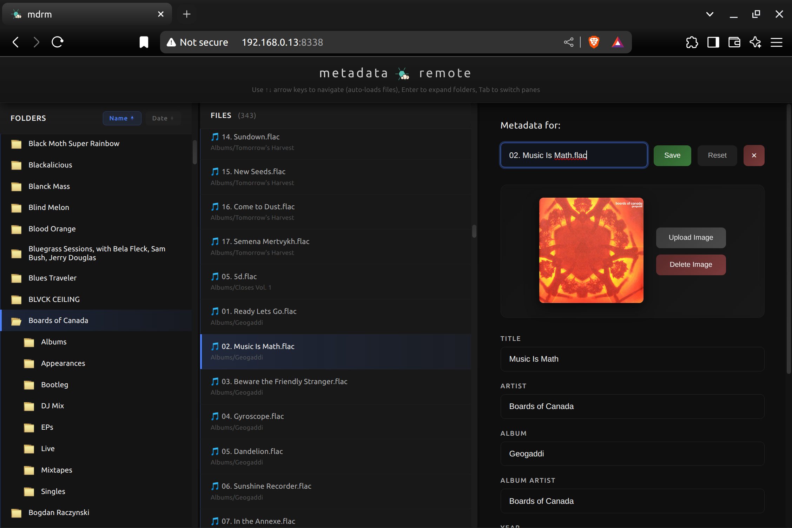

# Metadata Remote (mdrm)

A powerful web-based metadata editor for audio files with smart inference, comprehensive editing history, and bulk operations - designed for managing large music collections efficiently.



## ✨ Key Features

### 🧠 Smart Metadata Inference
Intelligent suggestions using pattern recognition, folder structure analysis, and MusicBrainz integration. Click any empty field to see confidence-scored suggestions.

### 📝 Complete Editing History
Full undo/redo system. Tracks up to 1000 edits, revert mistakes, and even undo bulk operations across entire folders. Edit fearlessly.

### 🎵 Comprehensive Format Support
MP3, FLAC, WAV, WV, M4A, and WMA with format-aware editing. Visual indicators show capabilities and limitations for each format.

### 📁 Powerful Bulk Operations
Apply metadata or album art to entire folders instantly. Save individual fields or update everything at once.

### 🎨 Advanced Album Art Management
Upload, preview, delete, and bulk apply album art.

### 🔧 Auto-repair of Corrupted Embedded Images
Automatically detects and repairs damaged embedded images when editing.

### ⚡ Efficient Workflow
- **Keyboard-first navigation**: Arrow keys with smart repeat, Tab switching, Enter to expand
- **Real-time filtering**: Instant search within large folders
- **In-browser playback**: Stream files directly (supports most formats)
- **Direct file renaming**: Update filenames with automatic history tracking
- **Resizable panels**: Customize your workspace by dragging dividers

### 🌙 Modern Interface
Clean dark theme with smooth animations, loading states, and clear visual feedback for every action.

## 🚀 Quick Start

The easiest way to get started is using our pre-built Docker image.

> **Note:** Our image supports x86, ARM, and Apple Silicon processors automatically. Docker will download the correct version for your device.

### Prerequisites
- Docker and Docker Compose
- A music directory to manage

### Installation

1. Download the docker-compose.yml file:
```bash
wget https://raw.githubusercontent.com/wow-signal-dev/metadata-remote/main/docker-compose.yml
```

2. Edit the music directory path in `docker-compose.yml`:
```bash
nano docker-compose.yml
# Change the line: /path/to/your/music:/music
```

3. Start the application:
```bash
docker-compose up -d
```

4. Open your browser to `http://localhost:8338`

That's it! The container will automatically download and run the latest version.

## 📋 Usage Guide

### Navigation
- **↑↓ Arrow keys**: Navigate folders and files with smart key repeat
- **Enter**: Expand/collapse folders
- **Tab**: Switch between folder and file panes
- **Click filename header**: Rename files directly
- **Click empty field**: Get automatic intelligent suggestions

### Smart Metadata Inference
When you click on an empty metadata field, mdrm will:
1. Analyze the filename, folder structure, and nearby files
2. Query MusicBrainz if needed for additional data
3. Present suggestions with confidence scores
4. Click any suggestion to apply it instantly

### Editing History
- **Bottom panel**: Click to expand the editing history view
- **Timeline view**: See all changes in chronological order
- **Undo/Redo**: Revert or reapply any change in any order
- **Batch tracking**: Even bulk operations can be undone
- **Clear history**: Remove all history when needed

### Bulk Operations
- **Apply to File**: Save a single field to the current file
- **Apply to Folder**: Apply any field value to all files in the folder
- **Album Art**: Upload once, apply to entire album folders
- **Smart workflow**: Navigate → Edit → Apply to folder

### Album Art Management
- **Upload**: Click "Upload Image" to add new art
- **Save Image**: Save only the album art without other metadata
- **Apply to Folder**: Apply the same art to all files in the folder
- **Delete**: Remove embedded album art
- **Auto-repair**: Corrupted art is automatically detected and fixed

### Format Support & Limitations
Visual indicators show format capabilities:
- 🟢 **Green badges**: Indicate lossless formats (FLAC, WAV, WV)
- 🟡 **Yellow badges**: Indicate lossy formats (MP3, M4A, WMA)
- ⚠️ **Warning icons**: Indicate formats with limited metadata or album art support

## 🎯 Perfect For

- **Jellyfin/Plex preparation**: Organize metadata before importing
- **Large music collections**: Efficient bulk editing with history tracking
- **FLAC libraries**: Full metadata and album art support
- **Mixed format libraries**: Handle different formats intelligently
- **Metadata cleanup**: Fix inconsistent tags across albums
- **Archive management**: Track all changes for accountability

## ⚙️ Configuration

### Environment Variables
- `PUID`: User ID for file permissions (default: 1000)
- `PGID`: Group ID for file permissions (default: 1000)
- `MUSIC_DIR`: Music directory path (default: /music)

### Ports
- `8338`: Web interface (customizable in docker-compose.yml)

### Volumes
- `/music`: Your music directory (read/write access required)

## 🔒 Security

⚠️ **IMPORTANT**: This application is designed for LOCAL USE ONLY and should NEVER be exposed to the internet without proper authentication and encryption.

## 🏗️ Architecture

### Backend
- **Framework**: Python Flask
- **Audio Processing**: FFmpeg for reading/writing metadata
- **Inference Engine**: Custom pattern recognition algorithm + MusicBrainz API
- **History System**: In-memory with temporary file storage for album art

### Frontend
- **Framework**: Vanilla JavaScript (no dependencies)
- **UI Components**: Custom-built with modern CSS
- **State Management**: Centralized state object pattern
- **Performance**: Debounced operations, request cancellation

### Container
- **Base**: Alpine Linux (ultra-lightweight)
- **Size**: Only 189MB (75% smaller than alternatives)
- **Architecture**: Multi-arch support (x86_64, arm64, armv7)

## 🐛 Troubleshooting

### Permission Issues
Ensure PUID/PGID match your user:
```bash
id -u  # Your user ID
id -g  # Your group ID
```

### Can't Access the Interface
```bash
docker ps               # Check if container is running
docker-compose logs     # View logs for errors
```

### Inference Not Working
- Ensure you have internet connectivity for MusicBrainz queries
- Check browser console for errors
- Try refreshing the page

### History Not Saving
- History is stored in memory and clears on container restart
- This is by design for privacy and performance
- Future versions may add persistent storage options

## 🤝 Contributing

We welcome contributions! Please:
1. Fork the repository
2. Create a feature branch
3. Make your changes
4. Submit a pull request

See [CONTRIBUTING.md](CONTRIBUTING.md) for detailed guidelines.

## 👥 Contributors

- [@gauravjot](https://github.com/gauravjot) - File filtering feature
- [@you](https://github.com/you) - Your contribution here!

## 📄 License

AGPL-3.0 License - see [LICENSE](LICENSE) file for details.

## 🙏 Acknowledgments

- Built for the self-hosted media server community
- MusicBrainz for their amazing open music database
- FFmpeg team for reliable audio processing
- All our users and contributors

---

*Version 1.0 - Released June 2025*

**Made with ❤️ for music lovers and metadata perfectionists**
