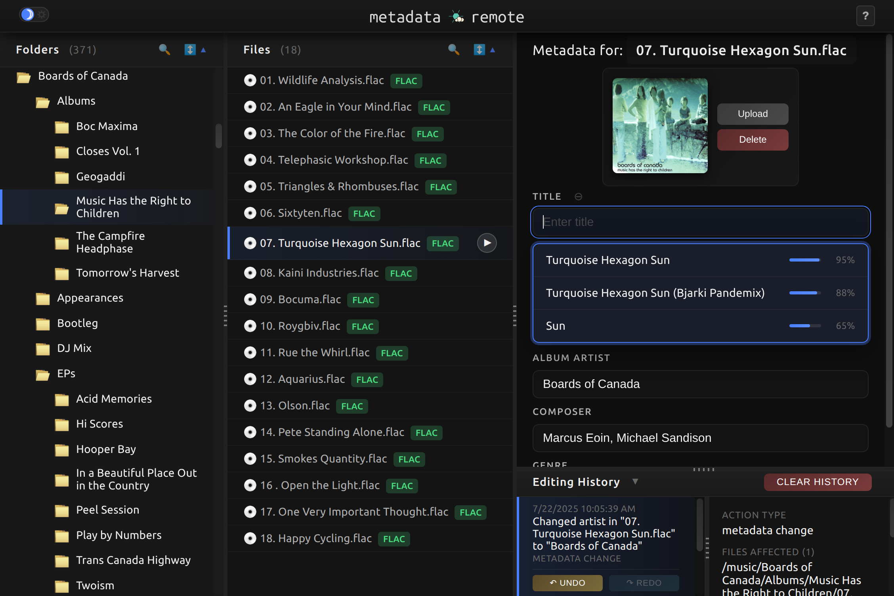

# Metadata Remote (mdrm)

A modern web-based metadata editor for audio files, designed for managing large music collections with clean bulk editing capabilities.



## Features

- 🎵 **Multi-format support**: MP3 and FLAC files
- 🎨 **Album art management**: Upload, preview, and apply to entire folders
- 📁 **Bulk operations**: Apply metadata to all files in a folder
- ⌨️ **Keyboard navigation**: Arrow keys, tab switching, and shortcuts
- 🎛️ **Three-pane interface**: Folders, files, and metadata editing
- 🔄 **File renaming**: Direct file management through the web interface
- 🌙 **Modern dark UI**: Responsive design with resizable panes

## Usage

### Navigation
- **Arrow keys**: Navigate folders and files
- **Enter**: Expand/collapse folders or reload file metadata
- **Tab**: Switch between folder and file panes
- **Click filename**: Rename files directly

### Bulk Operations
- **Apply to Folder**: Change any metadata field for all files in a folder
- **Album Art**: Upload once, apply to entire album folders
- **Keyboard workflow**: Navigate → Enter → Edit → Save

### Perfect for
- Jellyfin/Plex media server preparation
- Large music collection organization
- FLAC library management
- Batch metadata cleanup

## Technical Details

- **Backend**: Python Flask with FFmpeg
- **Frontend**: Vanilla JavaScript with modern CSS
- **Audio Processing**: FFprobe for reading, FFmpeg for writing
- **Deployment**: Docker with proper file permissions (UID 1000:1000)

## 🚀 Quick Start

**Requirements:**
- Docker and Docker Compose
- A music directory to manage

### Option 1: Using Docker Compose (Recommended)

1. **Download the compose file:**
   ```bash
   curl -O https://raw.githubusercontent.com/wow-signal-dev/metadata-remote/main/docker-compose.prod.yml
   ```

2. **Edit the music directory path in the file:**
   ```yaml
   volumes:
     - /your/actual/music/path:/music  # Change this line
   ```

3. **Start the application:**
   ```bash
   docker-compose -f docker-compose.prod.yml up -d
   ```

4. **Open your browser to `http://localhost:8338`**

### Option 2: Using Portainer

Copy this compose configuration into Portainer's "Add stack" section:

```yaml
version: '3.8'
services:
  metadata-remote:
    image: ghcr.io/wow-signal-dev/metadata-remote:latest
    container_name: metadata-remote
    restart: unless-stopped
    ports:
      - "8338:8338"
    volumes:
      - /your/music/path:/music  # CHANGE THIS to your music directory
    environment:
      - UID=1000
      - GID=1000
    user: "1000:1000"
```

Update the volume path and deploy the stack.

### Option 3: Direct Docker Run

```bash
docker run -d \
  --name metadata-remote \
  -p 8338:8338 \
  -v /your/music/path:/music \
  -e UID=1000 -e GID=1000 \
  --user 1000:1000 \
  ghcr.io/wow-signal-dev/metadata-remote:latest
```

## 🎵 Usage

- **Arrow keys**: Navigate folders and files
- **Enter**: Expand/collapse folders or reload file metadata
- **Tab**: Switch between folder and file panes
- **Click filename**: Rename files directly
- **Apply to Folder**: Change any metadata field for all files in a folder
- **Album Art**: Upload once, apply to entire album folders
- **Keyboard workflow**: Navigate → Enter → Edit → Save

## 🎯 Use Cases

- Jellyfin/Plex media server preparation
- Large music collection organization
- FLAC library management
- Batch metadata cleanup

## 🛠️ Development Setup

Want to contribute or modify the code? Here's how to build from source:

1. **Clone this repository:**
   ```bash
   git clone https://github.com/wow-signal-dev/metadata-remote.git
   cd metadata-remote
   ```

2. **Update the music directory path in `docker-compose.yml`:**
   ```yaml
   volumes:
     - /your/music/path:/music # Change this line
   ```

3. **Start the application:**
   ```bash
   docker-compose up -d
   ```

4. **Open your browser to `http://localhost:8338`**

## Contributing

Found a bug or have a feature request? Please open an issue!

Pull requests welcome - see [CONTRIBUTING.md](CONTRIBUTING.md) for guidelines.

## License

MIT License - see [LICENSE](LICENSE) file for details.

## Acknowledgments

Built for the self-hosted media server community 🏠
