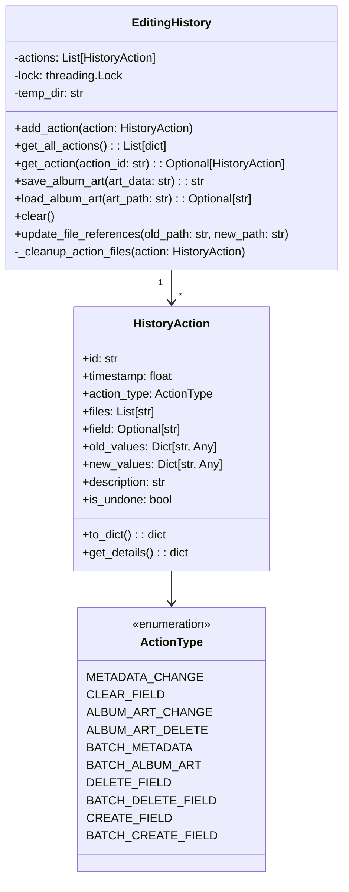
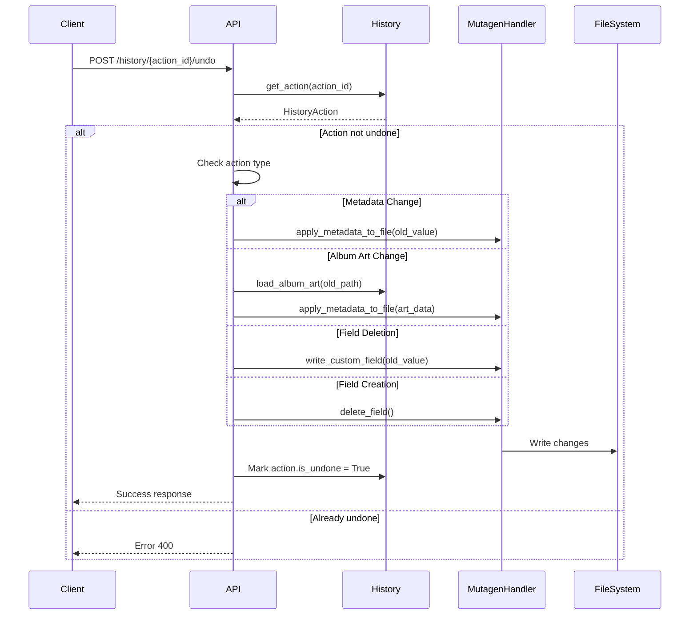

# Editing History System Backend Analysis

## Table of Contents

1. [Executive Summary](#executive-summary)
2. [Core Architecture](#core-architecture)
   - [History Module Structure](#history-module-structure)
   - [Data Structures](#data-structures)
   - [Action Types](#action-types)
3. [Action Tracking System](#action-tracking-system)
   - [Action Creation](#action-creation)
   - [History Storage](#history-storage)
   - [File Reference Management](#file-reference-management)
4. [Undo/Redo Implementation](#undoredo-implementation)
   - [Undo Operation Flow](#undo-operation-flow)
   - [Redo Operation Flow](#redo-operation-flow)
   - [State Management](#state-management)
5. [API Endpoints](#api-endpoints)
   - [Endpoint Documentation](#endpoint-documentation)
   - [Request/Response Formats](#requestresponse-formats)
6. [Action Type Implementations](#action-type-implementations)
   - [Metadata Changes](#metadata-changes)
   - [Album Art Operations](#album-art-operations)
   - [Field Management](#field-management)
   - [Batch Operations](#batch-operations)
7. [Storage and Persistence](#storage-and-persistence)
   - [Memory Management](#memory-management)
   - [Temporary File Storage](#temporary-file-storage)
   - [Cleanup Strategies](#cleanup-strategies)
8. [Error Handling](#error-handling)
   - [Partial Success Handling](#partial-success-handling)
   - [Rollback Strategies](#rollback-strategies)
9. [Performance Considerations](#performance-considerations)
10. [Recommendations for Robustness](#recommendations-for-robustness)

## Executive Summary

The Metadata Remote editing history system provides comprehensive tracking and reversal capabilities for all metadata and album art modifications. Built around a centralized `EditingHistory` class in `core/history.py`, the system tracks ten distinct action types with support for single-file and batch operations.

Key features include:
- Thread-safe operation with mutex locking
- Temporary file storage for album art history
- Automatic memory management with configurable limits (1000 actions)
- File reference updating for rename operations (both file and folder renames)
- Partial success handling for batch operations
- Intelligent batch operation detection (distinguishes field creation from updates)
- No transactional guarantees or automatic rollback

The system follows a command pattern where each action stores both old and new values, enabling bidirectional state transitions through undo/redo operations.

## Core Architecture

### History Module Structure

The history system is implemented in `core/history.py` with the following key components:

```python
# core/history.py lines 22-34
class ActionType(Enum):
    """Types of actions that can be performed"""
    METADATA_CHANGE = "metadata_change"
    CLEAR_FIELD = "clear_field"
    ALBUM_ART_CHANGE = "album_art_change"
    ALBUM_ART_DELETE = "album_art_delete"
    BATCH_METADATA = "batch_metadata"
    BATCH_ALBUM_ART = "batch_album_art"
    DELETE_FIELD = "delete_field"
    BATCH_DELETE_FIELD = "batch_delete_field"
    CREATE_FIELD = "create_field"
    BATCH_CREATE_FIELD = "batch_create_field"
```

### Data Structures

#### HistoryAction Dataclass

The core data structure for tracking changes:

```python
# core/history.py lines 34-46
@dataclass
class HistoryAction:
    """Represents a single action in the editing history"""
    id: str                              # Unique UUID for each action
    timestamp: float                     # Unix timestamp of action
    action_type: ActionType             # Enum defining the operation type
    files: List[str]                    # Absolute paths of affected files
    field: Optional[str]                # Metadata field name (if applicable)
    old_values: Dict[str, Any]          # Map of filepath -> old value
    new_values: Dict[str, Any]          # Map of filepath -> new value
    description: str                    # Human-readable description
    is_undone: bool = False            # Tracks undo/redo state
```

#### EditingHistory Class Diagram



### Action Types

Each action type serves a specific purpose:

1. **METADATA_CHANGE**: Single file metadata field modification
2. **CLEAR_FIELD**: Explicit field clearing (normalized to empty string)
3. **ALBUM_ART_CHANGE**: Album art replacement
4. **ALBUM_ART_DELETE**: Album art removal
5. **BATCH_METADATA**: Multiple file metadata changes
6. **BATCH_ALBUM_ART**: Multiple file album art changes
7. **DELETE_FIELD**: Complete field removal from file
8. **BATCH_DELETE_FIELD**: Multiple file field deletion
9. **CREATE_FIELD**: New custom field creation
10. **BATCH_CREATE_FIELD**: Multiple file field creation

## Action Tracking System

### Action Creation

Helper functions create properly formatted actions:

```python
# core/history.py lines 228-264
def create_metadata_action(filepath: str, field: str, old_value: str, 
                          new_value: str, action_type: str = 'metadata_change') -> HistoryAction:
    """Create a history action for a single metadata change"""
    filename = os.path.basename(filepath)
    
    # Normalize single spaces for display
    display_old = '' if old_value == ' ' else old_value
    display_new = '' if new_value == ' ' else new_value
    
    # Dynamic description generation based on action type
    # Returns properly configured HistoryAction instance
```

### History Storage

The `EditingHistory` class manages action storage with thread safety:

```python
# core/history.py lines 94-103
def add_action(self, action: HistoryAction):
    """Add a new action to the history"""
    with self.lock:
        self.actions.append(action)
        # Keep only last N actions to prevent memory issues
        if len(self.actions) > MAX_HISTORY_ITEMS:
            # Clean up old album art files if any
            old_action = self.actions.pop(0)
            self._cleanup_action_files(old_action)
```

### File Reference Management

When files are renamed, all history references are updated:

```python
# core/history.py lines 191-222
def update_file_references(self, old_path: str, new_path: str):
    """Update all actions that reference a file when it gets renamed
    
    This method is called when:
    - Individual files are renamed
    - Folders are renamed (updates all files within the folder)
    """
    with self.lock:
        for action in self.actions:
            # Update files list
            # Update old_values keys
            # Update new_values keys
```

## Undo/Redo Implementation

### Undo Operation Flow



### Redo Operation Flow

The redo operation mirrors undo but applies new values:

```python
# app.py lines 921-1055
@app.route('/history/<action_id>/redo', methods=['POST'])
def redo_action(action_id):
    """Redo a previously undone action"""
    # Similar structure to undo but:
    # - Checks if action.is_undone == True
    # - Applies new_values instead of old_values
    # - Sets action.is_undone = False
```

#### MP3/WAV Field Creation Redo Fix

A critical issue was discovered and fixed for MP3/WAV field creation redo operations. The history system stores ID3 frame IDs (e.g., "TALB" for album) but the `write_custom_field` method expects semantic field names (e.g., "album"). This mismatch caused redo operations to fail for CREATE_FIELD and BATCH_CREATE_FIELD actions on MP3/WAV files.

**The Problem**:
- During field creation, MP3/WAV files normalize semantic names to ID3 frame IDs
- History stores the frame ID (e.g., "TALB")
- During redo, `write_custom_field` expects the semantic name (e.g., "album")
- This caused a mismatch that prevented successful redo operations

**The Solution**:

```python
# app.py lines 1269-1291 (CREATE_FIELD redo)
elif action.action_type == ActionType.CREATE_FIELD:
    # Redo field creation
    filepath = action.files[0]
    field = action.field
    value = action.new_values[filepath]
    
    # For MP3/WAV files, reverse-map frame IDs to semantic names
    from core.file_utils import get_file_format
    _, _, base_format = get_file_format(filepath)
    
    if base_format in ['mp3', 'wav']:
        # Check if this is a frame ID that needs to be converted back
        if field in mutagen_handler.frame_to_field:
            field = mutagen_handler.frame_to_field[field]
    
    try:
        success = mutagen_handler.write_custom_field(filepath, field, value)
        if success:
            files_updated += 1
        else:
            errors.append(f"{os.path.basename(filepath)}: Failed to recreate field")
    except Exception as e:
        errors.append(f"{os.path.basename(filepath)}: {str(e)}")
```

Similar logic is applied for BATCH_CREATE_FIELD operations (app.py lines 1293-1314).

**Technical Details**:
- The `mutagen_handler.frame_to_field` dictionary contains reverse mappings (e.g., "TALB" → "album")
- This mapping is built during initialization in the `_build_id3_mappings()` method
- The fix only affects MP3 and WAV files which use ID3 tagging
- Other formats (FLAC, OGG, etc.) are unaffected as they don't normalize field names

### State Management

The `is_undone` boolean flag tracks action state:
- `False`: Action is in effect (can be undone)
- `True`: Action has been undone (can be redone)

## API Endpoints

### Endpoint Documentation

| Endpoint | Method | Description | Response |
|----------|--------|-------------|----------|
| `/history` | GET | Get all editing history | `{"actions": [...]}` |
| `/history/<action_id>` | GET | Get specific action details | Action details with changes |
| `/history/<action_id>/undo` | POST | Undo a specific action | Status with files updated |
| `/history/<action_id>/redo` | POST | Redo an undone action | Status with files updated |
| `/history/clear` | POST | Clear all history | Success message |

### Request/Response Formats

#### Get History Response
```json
{
  "actions": [
    {
      "id": "uuid-string",
      "timestamp": 1234567890.123,
      "action_type": "metadata_change",
      "files": ["/path/to/file.mp3"],
      "field": "title",
      "description": "Changed title in \"file.mp3\" from \"Old\" to \"New\"",
      "is_undone": false,
      "file_count": 1
    }
  ]
}
```

#### Undo/Redo Response
```json
{
  "status": "success|partial|error",
  "filesUpdated": 5,
  "action": { /* action details */ },
  "errors": ["file1.mp3: Permission denied"] // if partial/error
}
```

## Action Type Implementations

### Metadata Changes

Single file metadata change tracking:

```python
# app.py lines 402-406
action_type = 'clear_field' if not normalized_new and normalized_old else 'metadata_change'
action = create_metadata_action(filepath, field, old_value, new_value, action_type)
history.add_action(action)
```

### Album Art Operations

Album art changes use temporary file storage:

```python
# core/album_art/manager.py lines 33-49
if track_history:
    current_art = extract_album_art(filepath)
    # Save to history's temporary storage
    old_art_path = history.save_album_art(current_art) if current_art else ''
    new_art_path = history.save_album_art(art_data) if art_data else ''
    
    # Create and add history action
    if remove_art:
        action = create_album_art_action(filepath, current_art, None, is_delete=True)
    else:
        action = create_album_art_action(filepath, current_art, art_data)
    
    # Update the action with the saved paths
    action.old_values[filepath] = old_art_path
    action.new_values[filepath] = new_art_path
    
    history.add_action(action)
```

### Field Management

Field creation and deletion tracking:

```python
# app.py lines 467-469 (deletion)
action = create_delete_field_action(file_path, field_id, previous_value)
history.add_action(action)

# app.py lines 673-675 (creation)
action = create_field_creation_action(full_path, history_field_name, value_to_write)
history.add_action(action)
```

**Note on MP3/WAV Field Creation**: For MP3 and WAV files, the `history_field_name` stored in CREATE_FIELD and BATCH_CREATE_FIELD actions will be the ID3 frame ID (e.g., "TALB") rather than the semantic field name (e.g., "album"). This is handled during redo operations through reverse mapping.

### Batch Operations

Batch operations track changes for multiple files with intelligent action type selection:

#### Intelligent Batch Operation Detection

The `/apply-field-to-folder` endpoint (app.py:841-905) now distinguishes between field creation and updates:

```python
# Pre-processing phase categorizes files
file_changes = []        # For files where field exists (updates)
files_to_create = []     # For files where field doesn't exist (creations)

# After processing, creates appropriate history actions
if file_changes:
    # BATCH_METADATA for updates
    action = create_batch_metadata_action(folder_path, field, value, file_changes)
    history.add_action(action)

if files_to_create:
    # BATCH_CREATE_FIELD for new fields
    batch_action = create_batch_field_creation_action(files_to_create, field, create_values)
    history.add_action(batch_action)
```

#### Batch Metadata Updates

```python
# core/history.py lines 284-307
def create_batch_metadata_action(folder_path: str, field: str, value: str, 
                                file_changes: List[Tuple[str, str, str]]) -> HistoryAction:
    """Create a history action for batch metadata changes"""
    old_values = {}
    new_values = {}
    files = []
    
    for filepath, old_value, new_value in file_changes:
        files.append(filepath)
        old_values[filepath] = old_value
        new_values[filepath] = new_value
```

#### Batch Field Creation

```python
# core/history.py lines 386-399
def create_batch_field_creation_action(filepaths: List[str], field_name: str, 
                                      field_values: Dict[str, str]) -> HistoryAction:
    """Create history action for batch field creation"""
    description = f"Created field '{field_name}' in {len(filepaths)} files"
    
    return HistoryAction(
        id=str(uuid.uuid4()),
        timestamp=time.time(),
        action_type=ActionType.BATCH_CREATE_FIELD,
        files=filepaths,
        field=field_name,
        old_values={fp: None for fp in filepaths},  # Fields didn't exist
        new_values=field_values,
        description=description
    )
```

#### Batch Field Deletion

The batch field deletion functionality tracks field removals across multiple files:

```python
# core/history.py lines 401-422
def create_batch_delete_field_action(folder_path: str, field_id: str, 
                                   file_changes: List[Tuple[str, str]]) -> HistoryAction:
    """Create history action for batch field deletion"""
    folder_name = os.path.basename(folder_path) or "root"
    description = f"Deleted field '{field_id}' from {len(file_changes)} files in \"{folder_name}\""
    
    old_values = {}
    files = []
    
    for filepath, previous_value in file_changes:
        files.append(filepath)
        old_values[filepath] = previous_value
    
    return HistoryAction(
        id=str(uuid.uuid4()),
        timestamp=time.time(),
        action_type=ActionType.BATCH_DELETE_FIELD,
        files=files,
        field=field_id,
        old_values=old_values,
        new_values={filepath: None for filepath in files},
        description=description
    )
```

This action type stores the original field values for each file, enabling full restoration during undo operations.

## Storage and Persistence

### Memory Management

The system enforces a maximum of 1000 actions (configured in `config.py:51`):

```python
# core/history.py lines 99-103
if len(self.actions) > MAX_HISTORY_ITEMS:
    # Clean up old album art files if any
    old_action = self.actions.pop(0)
    self._cleanup_action_files(old_action)
```

### Temporary File Storage

Album art is stored in temporary files:

```python
# core/history.py lines 117-137
def save_album_art(self, art_data: str) -> str:
    """Save album art to temp file and return the path"""
    if not art_data:
        return ''
    
    # Generate unique filename using MD5 hash
    art_hash = hashlib.md5(art_data.encode()).hexdigest()
    art_path = os.path.join(self.temp_dir, f"{art_hash}.jpg")
    
    # Save only if not already exists (deduplication)
    if not os.path.exists(art_path):
        # Decode base64 and write to file
```

### Cleanup Strategies

Cleanup occurs at three levels:

1. **Action removal** (when exceeding MAX_HISTORY_ITEMS)
2. **Manual clear** via `/history/clear` endpoint
3. **Process termination** via `__del__` method

```python
# core/history.py lines 152-167
def _cleanup_action_files(self, action: HistoryAction):
    """Clean up any temporary files associated with an action"""
    if action.action_type in [ActionType.ALBUM_ART_CHANGE, 
                             ActionType.ALBUM_ART_DELETE, 
                             ActionType.BATCH_ALBUM_ART]:
        # Remove old and new album art files
```

## Error Handling

### Partial Success Handling

Batch operations track individual file failures:

```python
# app.py lines 812-820 (example from batch undo)
for filepath in action.files:
    try:
        old_value = action.old_values.get(filepath, '')
        apply_metadata_to_file(filepath, {action.field: old_value})
        files_updated += 1
    except Exception as e:
        errors.append(f"{os.path.basename(filepath)}: {str(e)}")
```

Response indicates partial success:

```python
# app.py lines 904-915
if files_updated == 0:
    response_data['status'] = 'error'
    return jsonify(response_data), 500
elif errors:
    response_data['status'] = 'partial'
    response_data['errors'] = errors
    return jsonify(response_data)
else:
    response_data['status'] = 'success'
    return jsonify(response_data)
```

### Rollback Strategies

**Important**: The system does NOT implement automatic rollback. If a batch operation partially fails:

1. Successfully processed files remain changed
2. Failed files are logged in the errors array
3. The action is still marked as complete (or undone/redone)
4. No automatic reversal of successful changes occurs

This design choice prioritizes transparency and partial success over transactional guarantees.

## Performance Considerations

### Memory Usage

1. **Action Storage**: Each action stores full file paths and values
   - Memory usage: ~1-2KB per single-file action
   - Batch actions: scales with number of files
   - Maximum memory: ~1-2MB for 1000 actions

2. **Album Art Storage**: 
   - Stored as temporary files, not in memory
   - MD5 deduplication prevents duplicate storage
   - Typical JPEG: 50-500KB per unique image

### Performance Bottlenecks

1. **Thread Locking**: All operations acquire a global lock
   - Impact: Serializes all history operations
   - Recommendation: Consider read-write locks

2. **File I/O for Album Art**:
   - Each art save/load requires disk I/O
   - No caching mechanism implemented

3. **Linear Search**: `get_action()` uses O(n) search
   ```python
   # core/history.py lines 111-115
   for action in self.actions:
       if action.id == action_id:
           return action
   ```

4. **Batch Operations**: No parallelization
   - Files processed sequentially
   - Could benefit from thread pool

### Optimization Opportunities

1. **Action Lookup**: Use dictionary for O(1) lookup
2. **Album Art Cache**: Implement LRU cache for frequently accessed art
3. **Batch Processing**: Parallelize file operations
4. **Compression**: Compress old_values/new_values for text fields

## Recommendations for Robustness

### 1. Implement Transactional Semantics

Add atomic batch operations with rollback:

```python
class TransactionalBatch:
    def __init__(self):
        self.operations = []
        self.completed = []
    
    def add_operation(self, operation):
        self.operations.append(operation)
    
    def execute(self):
        try:
            for op in self.operations:
                result = op.execute()
                self.completed.append((op, result))
        except Exception as e:
            self.rollback()
            raise
    
    def rollback(self):
        for op, result in reversed(self.completed):
            op.undo(result)
```

### 2. Add Persistence Layer

Implement optional SQLite backend for history:

```python
class PersistentHistory:
    def __init__(self, db_path):
        self.conn = sqlite3.connect(db_path)
        self._create_tables()
    
    def add_action(self, action):
        # Serialize to database
        # Keep recent in memory cache
```

### 3. Improve Error Recovery

Add retry logic and better error classification:

```python
def apply_with_retry(operation, max_retries=3):
    for attempt in range(max_retries):
        try:
            return operation()
        except PermissionError:
            raise  # Don't retry permission errors
        except Exception as e:
            if attempt == max_retries - 1:
                raise
            time.sleep(0.1 * (attempt + 1))
```

### 4. Add Validation Layer

Validate operations before execution:

```python
def validate_undo(action: HistoryAction) -> List[str]:
    issues = []
    for filepath in action.files:
        if not os.path.exists(filepath):
            issues.append(f"File not found: {filepath}")
        elif not os.access(filepath, os.W_OK):
            issues.append(f"No write permission: {filepath}")
    return issues
```

### 5. Enhanced Field Name Mapping

Consider storing both semantic and format-specific field names in history:

```python
@dataclass
class FieldInfo:
    semantic_name: str  # e.g., "album"
    format_specific_name: str  # e.g., "TALB" for MP3
    
# In HistoryAction
field_info: Optional[FieldInfo]  # Instead of just field: str
```

This would eliminate the need for reverse mapping during redo operations.

### 6. Implement History Compression

Merge related actions to reduce memory:

```python
def compress_history(actions: List[HistoryAction]) -> List[HistoryAction]:
    # Merge consecutive actions on same file/field
    # Combine rapid successive edits
    # Remove cancelled operations (edit then undo)
```

### 7. Add Monitoring and Metrics

Track history system health:

```python
class HistoryMetrics:
    def __init__(self):
        self.action_counts = Counter()
        self.error_counts = Counter()
        self.undo_success_rate = 0.0
        self.avg_action_size = 0.0
```

### 8. Implement History Export/Import

Allow history backup and restore:

```python
def export_history(self, path: str):
    """Export history to JSON file"""
    
def import_history(self, path: str):
    """Import history from JSON file"""
```

### 9. Add Action Grouping

Group related actions for better UX:

```python
class ActionGroup:
    def __init__(self, description: str):
        self.id = str(uuid.uuid4())
        self.description = description
        self.actions = []
        self.timestamp = time.time()
```

### 10. Improve Thread Safety

Use read-write locks for better concurrency:

```python
from threading import RWLock

class EditingHistory:
    def __init__(self):
        self.lock = RWLock()
    
    def get_all_actions(self):
        with self.lock.read():
            return [...]
    
    def add_action(self, action):
        with self.lock.write():
            # ...
```

### 11. Add History Compaction

Implement periodic compaction to manage long-running sessions:

```python
def compact_history(self):
    """Remove redundant actions and compress history"""
    # Remove fully undone then redone sequences
    # Merge field updates on same file
    # Archive old actions to disk
```

## Conclusion

The Metadata Remote editing history system provides a solid foundation for tracking and reversing file modifications. While it successfully handles the core use cases, implementing the recommended improvements would significantly enhance its robustness, performance, and reliability for production use. The modular design and clear separation of concerns make these enhancements feasible without major architectural changes.