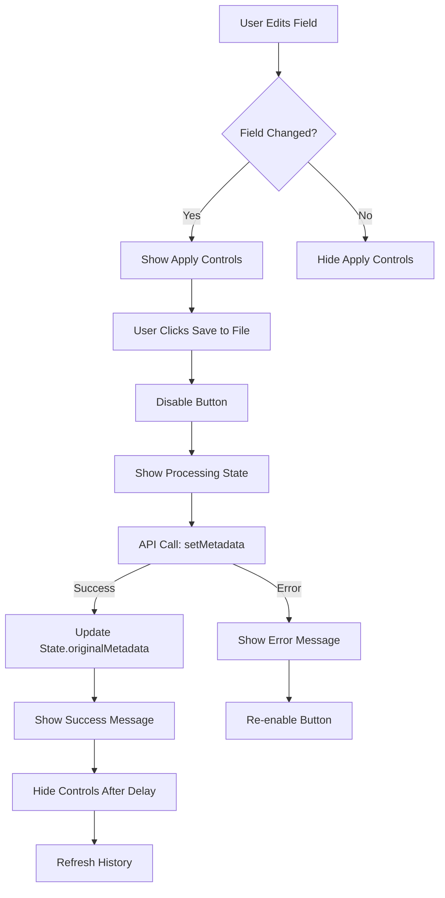
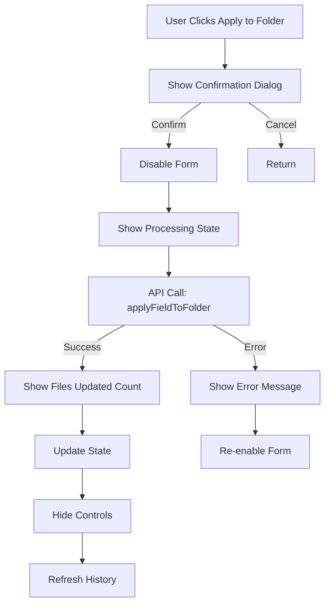

# Individual Metadata Field Save Frontend Architecture

## Table of Contents

1. [Executive Summary](#executive-summary)
2. [Save Workflow Diagrams](#save-workflow-diagrams)
3. [Field Save UI Components](#field-save-ui-components)
4. [Validation Rules Matrix](#validation-rules-matrix)
5. [API Communication Patterns](#api-communication-patterns)
6. [UI State Transitions](#ui-state-transitions)
7. [Error Handling Strategies](#error-handling-strategies)
8. [Performance Optimizations](#performance-optimizations)
9. [Specific Code References](#specific-code-references)

## Executive Summary

The individual metadata field save functionality in Metadata Remote provides a sophisticated user experience with real-time validation, optimistic UI updates, and comprehensive error handling. The system supports both standard metadata fields (title, artist, album, etc.) and dynamic custom fields, with the ability to apply changes to individual files or entire folders.

Key features include:
- **Progressive disclosure UI**: Save controls appear only when fields are modified
- **Dual-mode saving**: Apply to individual file or entire folder
- **Grouped field controls**: Track, disc, and date fields share a unified control panel
- **Real-time validation**: Input validation with format-aware custom field naming
- **Visual feedback**: Button status animations and state transitions
- **Focus preservation**: Maintains user context during save operations
- **History integration**: All changes are tracked in the history panel

## Save Workflow Diagrams

### Individual Field Save Flow



### Folder Apply Flow



## Field Save UI Components

### 1. Standard Field Structure (`editor.js:584-617`)
```javascript
<div class="form-group-with-button standard-field">
    <div class="form-group-wrapper">
        <div class="label-with-delete">
            <label>Field Name</label>
            <button class="delete-field-btn">⊖</button>
        </div>
        <div class="input-wrapper">
            <input type="text" data-field="fieldname" />
            <div class="inference-loading"></div>
            <div class="inference-suggestions"></div>
        </div>
    </div>
    <div class="apply-field-controls">
        <span>Apply to</span>
        <button class="apply-file-btn">File</button>
        <button class="apply-folder-btn-new">Folder</button>
    </div>
</div>
```

### 2. Grouped Fields Control (`editor.js:690-709`)
```javascript
<div id="grouped-apply-controls">
    <div id="grouped-apply-items">
        <div class="grouped-apply-item" data-field="track">
            <span class="field-change-indicator">Track #</span>
            <div class="apply-field-controls">
                <button class="apply-file-btn">File</button>
                <button class="apply-folder-btn-new">Folder</button>
            </div>
        </div>
    </div>
</div>
```

### 3. Dynamic Field Structure (`editor.js:770-815`)
```javascript
<div class="form-group-with-button dynamic-field">
    <!-- Similar structure with data-dynamic="true" -->
</div>
```

## Validation Rules Matrix

| Field Type | Validation Rules | Error Messages | Code Reference |
|------------|------------------|----------------|----------------|
| **Field Name Length** | Max 50 characters | "Field name must be 50 characters or less" | `editor.js:1027-1030` |
| **Field Name Characters** | No null bytes (\x00) | "Field name contains invalid characters" | `editor.js:1033-1036` |
| **Custom Field Names** | No = or ~ characters | "Field names cannot contain = or ~ characters" | `editor.js:969-971` |
| **Custom Field Format** | Alphanumeric + underscore + spaces | "Field names must contain only letters, numbers, underscores, or spaces" | `editor.js:1002-1007` |
| **Space Handling** | Format-aware warnings | Dynamic based on file format | `editor.js:975-999` |
| **Duplicate Fields** | Check existing fields | "Field already exists" | `editor.js:1070-1080` |
| **Real-time Validation** | Input event listener | Custom validity messages | `editor.js:127-136` |

### Format-Specific Validation (`editor.js:958-1011`)

```javascript
validateCustomFieldName(fieldName) {
    const currentFormat = State.metadata?.format || 'unknown';
    
    // Space-friendly formats
    const spaceFriendlyFormats = ['flac', 'ogg'];
    
    if (fieldName.includes(' ')) {
        if (spaceFriendlyFormats.includes(currentFormat)) {
            return {
                valid: true,
                warning: 'Field names with spaces may have limited compatibility...',
                suggestion: fieldName.replace(/\s+/g, '_')
            };
        }
    }
}
```

## API Communication Patterns

### 1. Individual Field Save (`editor.js:378-433`)

```javascript
async saveFieldToFile(field, showButtonStatus) {
    const data = {};
    data[field] = value === ' ' ? '' : value;
    
    const result = await API.setMetadata(State.currentFile, data);
    
    if (result.status === 'success') {
        State.originalMetadata[field] = value;
        loadHistoryCallback();
    }
}
```

### 2. Folder Apply (`editor.js:441-502`)

```javascript
async applyFieldToFolder(field, showButtonStatus, setFormEnabled) {
    const result = await API.applyFieldToFolder(folderPath, field, normalizedValue);
    
    if (result.status === 'success') {
        showButtonStatus(button, `Applied to ${result.filesUpdated} files!`, 'success');
    }
}
```

### 3. API Module Structure (`api.js:60-67`)

```javascript
async setMetadata(filepath, data) {
    return this.call(`/metadata/${encodeURIComponent(filepath)}`, {
        method: 'POST',
        headers: {'Content-Type': 'application/json'},
        body: JSON.stringify(data)
    });
}
```

## UI State Transitions

### 1. Button State Machine (`button-status.js:19-109`)

```javascript
States: idle -> processing -> success/error/warning -> idle

Transitions:
- Processing: Show spinner, disable button
- Success: Show checkmark, auto-clear after 3s
- Error: Show X mark, persist or auto-clear
- Warning: Show warning icon, auto-clear
```

### 2. Field Control Visibility (`editor.js:844-897`)

```javascript
updateControlsVisibility() {
    const hasChanged = input.value !== originalValue;
    
    if (groupedFields.includes(fieldId)) {
        // Handle grouped fields
    } else {
        // Handle individual fields
        controls.classList[hasChanged ? 'add' : 'remove']('visible');
    }
}
```

**Visibility Bug Fix** (`editor.js:168`):
The `hideFieldControls` function now properly removes both CSS class and inline styles for grouped controls:
```javascript
groupedControls.classList.remove('visible');
groupedControls.style.display = 'none';  // This line was added to fix persistence bug
```

### 3. Focus Management (`editor.js:289-298`)

```javascript
// Store focus before operation
const previouslyFocused = document.activeElement;

// Restore after operation
if (previouslyFocused && previouslyFocused.id) {
    const element = document.getElementById(previouslyFocused.id);
    element.focus();
}
```

## Error Handling Strategies

### 1. Network Error Handling (`api.js:17-28`)

```javascript
try {
    const response = await fetch(url, options);
    if (!response.ok) {
        const data = await response.json();
        throw new Error(data.error || 'Request failed');
    }
} catch (error) {
    console.error(`API error for ${url}:`, error);
    throw error;
}
```

### 2. Format-Specific Errors (`editor.js:278-285`)

```javascript
catch (err) {
    const errorMessage = err.message || '';
    if (errorMessage.includes('Album art is not supported')) {
        showButtonStatus(button, 'Album art not supported for this format', 'error', 5000);
    }
}
```

### 3. Validation Error Display (`editor.js:1022-1036`)

```javascript
if (!fieldNameInput) {
    UIUtils.showStatus('Field name is required', 'error');
    return;
}

if (fieldNameInput.length > 50) {
    UIUtils.showStatus('Field name must be 50 characters or less', 'error');
    return;
}
```

### 4. Rollback on Failure (`editor.js:425-430`)

```javascript
catch (err) {
    console.error(`Error saving ${field} to file:`, err);
    showButtonStatus(button, 'Error saving field', 'error');
    // Button is re-enabled for retry
    button.disabled = false;
}
```

## Performance Optimizations

### 1. Debounced Field Changes
- Input events trigger immediate UI updates
- API calls are made only on explicit save action
- No automatic saving prevents excessive API calls

### 2. Optimistic UI Updates (`editor.js:403-404`)
```javascript
// Update state immediately on success
State.originalMetadata[field] = value;
// Then refresh history asynchronously
loadHistoryCallback();
```

### 3. Selective Form Disabling (`ui/utilities.js:37-56`)
```javascript
setFormEnabled(enabled) {
    // Skip history panel buttons
    if (button.classList.contains('history-btn')) return;
    // Skip buttons in processing state
    if (button.classList.contains('processing')) return;
}
```

### 4. Efficient Field Detection (`editor.js:509-511`)
```javascript
isStandardField(fieldId) {
    return standardFields.includes(fieldId.toLowerCase());
}
```

### 5. Batch DOM Updates (`editor.js:517-758`)
- Renders all fields in one pass
- Uses insertAdjacentHTML for efficiency
- Attaches event listeners after rendering

## Specific Code References

1. **Field Save Entry Point**: `editor.js:378` - `saveFieldToFile()` function
2. **Folder Apply Entry Point**: `editor.js:441` - `applyFieldToFolder()` function
3. **Input Change Detection**: `editor.js:844-897` - `updateControlsVisibility()`
4. **Apply Controls Toggle**: `editor.js:146-178` - `hideFieldControls()` - Fixed to properly hide grouped controls
5. **API Communication**: `api.js:60-67` - `setMetadata()` method
6. **Button Status Updates**: `button-status.js:19-109` - `showButtonStatus()`
7. **Field Validation**: `editor.js:958-1011` - `validateCustomFieldName()`
8. **Error Handling**: `editor.js:425-430` - Catch block in `saveFieldToFile()`
9. **State Management**: `state.js:19` - `originalMetadata` tracking (populated carefully to prevent false change detection)
10. **History Integration**: `editor.js:412` - `loadHistoryCallback()` call
11. **Focus Preservation**: `editor.js:289-298` - Focus save/restore logic
12. **Grouped Fields Logic**: `editor.js:845-882` - Grouped field handling
13. **Dynamic Field Rendering**: `editor.js:767-835` - `renderDynamicField()`
14. **Field Deletion UI**: `editor.js:1166-1197` - `confirmDelete()`
15. **Custom Field Creation**: `editor.js:1017-1119` - `createNewField()`
16. **Form State Control**: `ui/utilities.js:37-56` - `setFormEnabled()`
17. **Space Normalization**: `editor.js:223,233,397,470` - Single space handling
18. **Success Notifications**: `editor.js:403,474` - Success message display
19. **Control Auto-hide**: `editor.js:407-409` - Delayed control hiding
20. **Event Listener Attachment**: `editor.js:624-630,666-674` - Field event setup

### Additional Implementation Details

#### Field Change Detection System
The system uses a sophisticated change detection mechanism that compares current field values against `State.originalMetadata`. This enables:
- Immediate visual feedback when fields are modified
- Accurate tracking of which fields need saving
- Proper cleanup when changes are reverted

**Important Note on State.originalMetadata**: 
The loading process (`files/manager.js:436-447`) carefully separates standard and dynamic fields when populating `State.originalMetadata`. Standard fields are populated from root-level API response data, while only non-standard fields are added from the `all_fields` object. This prevents false positive change detection in formats like WMA that may return duplicate field representations with slightly different values.

#### Progressive Disclosure Pattern
Apply controls are hidden by default and only shown when fields have unsaved changes. This reduces visual clutter and guides users to fields that need attention.

#### Format-Aware Behavior
The system adapts its behavior based on the file format:
- Space handling in field names varies by format
- Album art support is checked before attempting saves
- Validation rules adjust for format limitations

#### Accessibility Considerations
- All interactive elements are keyboard accessible
- Focus management preserves user context
- Status messages provide clear feedback
- Confirmation dialogs prevent accidental data loss