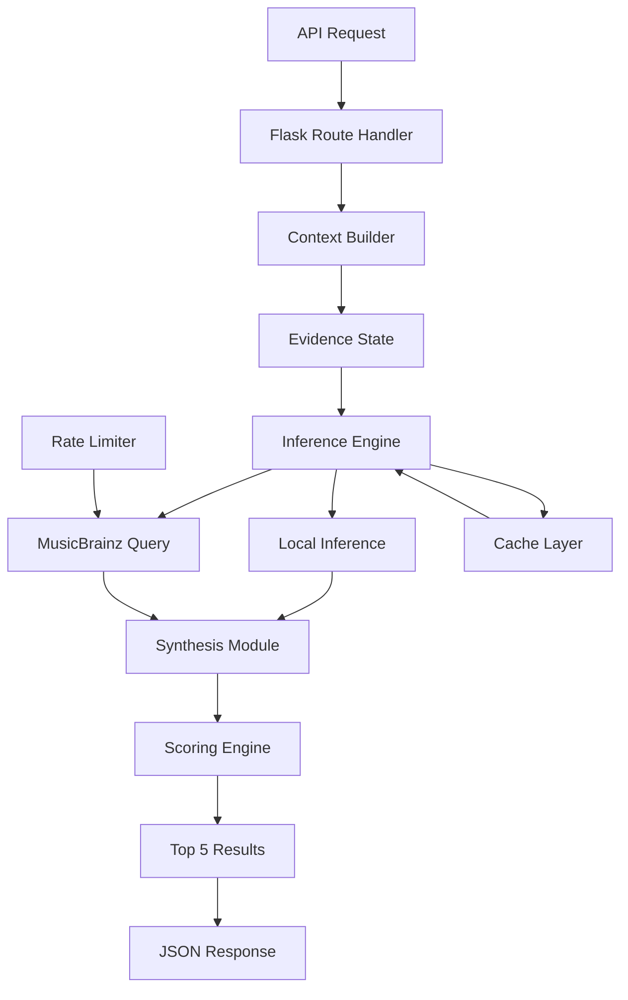
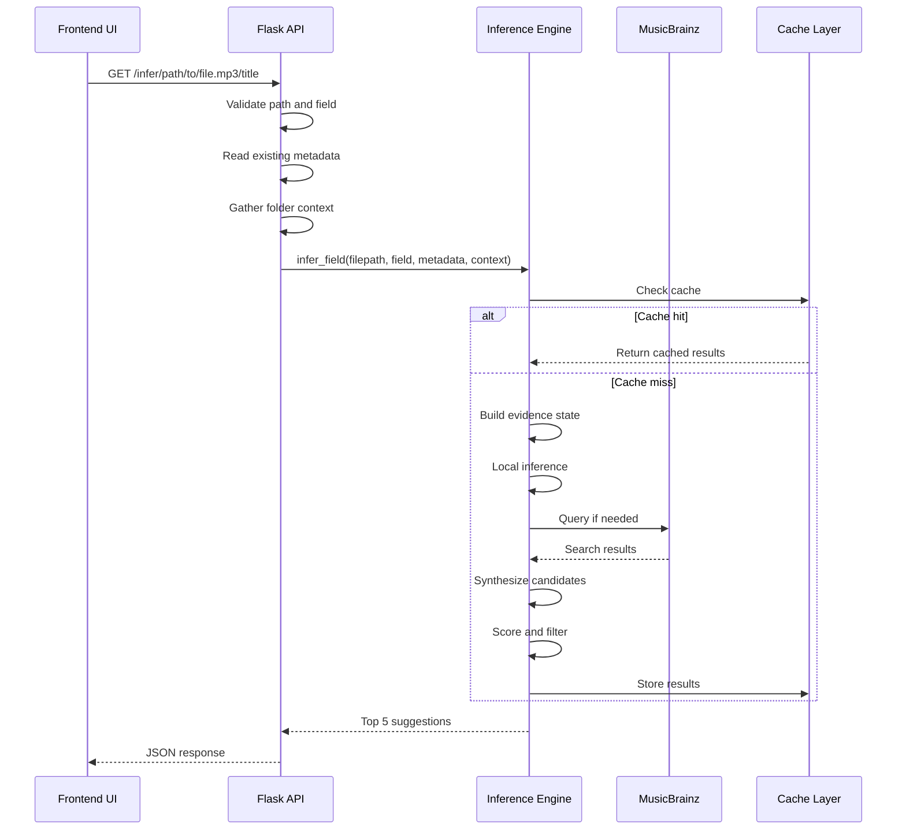

# Metadata Inference System - Backend Architecture

## Table of Contents

1. [Executive Summary](#executive-summary)
2. [Architecture Overview](#architecture-overview)
3. [Core Components](#core-components)
4. [Inference Engine Implementation](#inference-engine-implementation)
5. [Field-Specific Inference Logic](#field-specific-inference-logic)
6. [External Integration](#external-integration)
7. [API Endpoints](#api-endpoints)
8. [Data Flow](#data-flow)
9. [Caching Strategy](#caching-strategy)
10. [Performance Characteristics](#performance-characteristics)
11. [Error Handling](#error-handling)
12. [Security Considerations](#security-considerations)
13. [Code References](#code-references)

## Executive Summary

The Metadata Inference System backend implements a sophisticated multi-phase algorithm for suggesting metadata values based on contextual analysis. The system combines local pattern matching with external API queries (MusicBrainz) to provide accurate, confidence-scored suggestions for nine different metadata fields. Built on a modular architecture with caching and rate limiting, the system processes inference requests in under 2 seconds for most cases while maintaining high accuracy through its evidence-based approach.

## Architecture Overview

### System Design



### Key Design Principles

1. **Evidence-Based Inference**: All suggestions are backed by specific evidence
2. **Multi-Source Synthesis**: Combines multiple inference strategies
3. **Confidence Scoring**: Each suggestion includes a confidence percentage
4. **Context Awareness**: Uses file context, folder structure, and sibling patterns
5. **Performance Optimization**: Caching and rate limiting for external queries

## Core Components

### MetadataInferenceEngine Class

Located in `core/inference.py`, this class orchestrates the entire inference process:

```python
class MetadataInferenceEngine:
    def __init__(self):
        self.logger = logging.getLogger(__name__)
        self.mb_client = MusicBrainzClient()
        self.config = {
            'max_filename_length': 255,
            'default_confidence_threshold': 50,
            'candidate_limit': 10,
            'final_limit': 5
        }
        # Pattern matchers
        self.composer_patterns = self._build_composer_patterns()
        self.track_patterns = self._build_track_patterns()
        self.year_patterns = self._build_year_patterns()
        # Caching
        self._cache = {}
        self._cache_lock = threading.Lock()
        self._cache_duration = 3600  # 1 hour
```

### Configuration System

The inference system uses field-specific confidence thresholds defined in `config.py`:

```python
FIELD_THRESHOLDS = {
    'artist': 70,
    'album': 65,
    'title': 75,
    'track': 80,
    'date': 60,
    'genre': 55,
    'albumartist': 65,
    'disc': 75,
    'composer': 70
}
```

## Inference Engine Implementation

### Main Inference Pipeline

The `infer_field()` method implements a four-phase inference process:

```python
def infer_field(self, filepath, field, existing_metadata=None, folder_context=None):
    """
    Main entry point for field inference
    Returns top 5 candidates with confidence scores
    """
    # Phase 1: Build evidence state
    evidence_state = self._build_evidence_state(
        filepath, existing_metadata, folder_context
    )
    
    # Phase 2: Local inference
    local_candidates = self._perform_local_inference(field, evidence_state)
    
    # Phase 3: External inference (if needed)
    external_candidates = []
    if self._should_query_musicbrainz(field, local_candidates, existing_metadata):
        external_candidates = self._query_musicbrainz(evidence_state, field, local_candidates)
    
    # Phase 4: Synthesis and scoring
    all_candidates = self._synthesize_candidates(
        local_candidates, external_candidates, field
    )
    
    # Phase 5: Final scoring and filtering
    return self._score_and_filter(all_candidates, field, evidence_state)
```

### Evidence State Construction

The evidence state aggregates all available context for inference:

```python
def _build_evidence_state(self, filepath, existing_metadata, folder_context):
    """Builds comprehensive evidence state for inference"""
    path_obj = Path(filepath)
    
    state = {
        'filepath': str(filepath),
        'filename': path_obj.name,
        'filename_no_ext': path_obj.stem,
        'extension': path_obj.suffix.lower(),
        'folder_name': path_obj.parent.name,
        'parent_folder': path_obj.parent.parent.name,
        'folder_parts': self._split_folder_path(path_obj.parent),
        'existing_metadata': existing_metadata or {},
        'filename_segments': self._segment_filename(path_obj.stem),
        'sibling_patterns': {},
        'sibling_count': 0
    }
    
    # Analyze sibling files for patterns
    if folder_context:
        state['sibling_patterns'] = self._analyze_siblings(folder_context)
        state['sibling_count'] = len(folder_context)
    
    return state
```

### Pattern Analysis

The system uses sophisticated pattern matching for filename segmentation:

```python
def _segment_filename(self, filename):
    """Segments filename using multiple delimiters"""
    segments = []
    
    # Try different delimiter patterns
    delimiters = [' - ', ' – ', ' — ', '_-_', ' _ ', ' • ', ' | ']
    
    for delimiter in delimiters:
        if delimiter in filename:
            parts = filename.split(delimiter)
            segments.extend([p.strip() for p in parts if p.strip()])
            break
    
    # Fallback to space/underscore splitting
    if not segments:
        segments = re.split(r'[\s_]+', filename)
    
    # Clean segments
    return [self._clean_segment(s) for s in segments if len(s) > 1]
```

## Field-Specific Inference Logic

### Title Inference

The title inference handles complex filename patterns:

```python
def _infer_title(self, evidence_state):
    """Infers title from filename patterns"""
    candidates = []
    filename = evidence_state['filename_no_ext']
    segments = evidence_state['filename_segments']
    
    # Pattern 1: Track number prefix
    track_removed = self._remove_track_prefix(filename)
    if track_removed != filename:
        candidates.append({
            'value': track_removed,
            'confidence': 85,
            'source': 'local',
            'evidence': ['Removed track number prefix']
        })
    
    # Pattern 2: Artist - Title format
    if len(segments) >= 2:
        # Check if first segment matches artist
        if self._matches_artist(segments[0], evidence_state):
            title = ' - '.join(segments[1:])
            candidates.append({
                'value': title,
                'confidence': 90,
                'source': 'local',
                'evidence': ['Artist-Title pattern detected']
            })
    
    # Pattern 3: Clean common artifacts
    cleaned = self._clean_title_artifacts(filename)
    if cleaned != filename:
        candidates.append({
            'value': cleaned,
            'confidence': 75,
            'source': 'local',
            'evidence': ['Removed quality indicators/artifacts']
        })
    
    return candidates
```

### Artist Inference

Artist inference prioritizes folder structure:

```python
def _infer_artist(self, evidence_state):
    """Infers artist from folder structure and filename"""
    candidates = []
    
    # Strategy 1: Folder name as artist
    folder_name = evidence_state['folder_name']
    if self._is_likely_artist_folder(folder_name):
        candidates.append({
            'value': folder_name,
            'confidence': 85,
            'source': 'local',
            'evidence': ['Folder name matches artist pattern']
        })
    
    # Strategy 2: Parent folder (Artist/Album structure)
    parent = evidence_state['parent_folder']
    if self._is_likely_artist_folder(parent):
        candidates.append({
            'value': parent,
            'confidence': 80,
            'source': 'local',
            'evidence': ['Parent folder matches artist pattern']
        })
    
    # Strategy 3: Extract from filename segments
    segments = evidence_state['filename_segments']
    if segments and self._is_likely_artist_name(segments[0]):
        candidates.append({
            'value': segments[0],
            'confidence': 70,
            'source': 'local',
            'evidence': ['First filename segment']
        })
    
    # Strategy 4: Use existing album artist
    if 'albumartist' in evidence_state['existing_metadata']:
        candidates.append({
            'value': evidence_state['existing_metadata']['albumartist'],
            'confidence': 75,
            'source': 'local',
            'evidence': ['Matches album artist']
        })
    
    return candidates
```

### Album Inference

Album inference focuses on folder analysis:

```python
def _infer_album(self, evidence_state):
    """Infers album from folder structure"""
    candidates = []
    folder_name = evidence_state['folder_name']
    
    # Pattern 1: Direct folder name
    if self._is_likely_album_folder(folder_name):
        # Clean common album artifacts
        cleaned = self._clean_album_name(folder_name)
        candidates.append({
            'value': cleaned,
            'confidence': 90,
            'source': 'local',
            'evidence': ['Folder name']
        })
    
    # Pattern 2: Artist - Album folder format
    if ' - ' in folder_name:
        parts = folder_name.split(' - ', 1)
        if len(parts) == 2:
            album = parts[1].strip()
            candidates.append({
                'value': album,
                'confidence': 85,
                'source': 'local',
                'evidence': ['Artist-Album folder pattern']
            })
    
    # Pattern 3: Year (Album) format
    year_match = re.search(r'\((\d{4})\)\s*(.+)', folder_name)
    if year_match:
        album = year_match.group(2).strip()
        candidates.append({
            'value': album,
            'confidence': 80,
            'source': 'local',
            'evidence': ['Year-Album folder pattern']
        })
    
    return candidates
```

### Track Number Inference

Track inference uses multiple regex patterns:

```python
def _infer_track(self, evidence_state):
    """Infers track number from filename"""
    candidates = []
    filename = evidence_state['filename_no_ext']
    
    # Comprehensive track patterns
    patterns = [
        (r'^(\d{1,3})[\.\s\-_]', 95),  # "01.", "01 ", "01-"
        (r'^\[(\d{1,3})\]', 90),        # "[01]"
        (r'^#(\d{1,3})\s', 85),         # "#01 "
        (r'track[\s\-_]?(\d{1,3})', 80), # "track01", "track 01"
        (r'\s(\d{1,3})[\s\-_]of[\s\-_]\d+', 85), # "01 of 12"
    ]
    
    for pattern, confidence in patterns:
        match = re.search(pattern, filename, re.IGNORECASE)
        if match:
            track_num = int(match.group(1))
            if 1 <= track_num <= 999:  # Reasonable track range
                candidates.append({
                    'value': str(track_num),
                    'confidence': confidence,
                    'source': 'local',
                    'evidence': [f'Pattern: {pattern}']
                })
    
    # Sibling pattern analysis
    if evidence_state['sibling_patterns'].get('track_pattern'):
        pattern_confidence = self._analyze_track_consistency(
            filename, evidence_state['sibling_patterns']['track_pattern']
        )
        if pattern_confidence > 70:
            candidates.append({
                'value': str(pattern_confidence['track']),
                'confidence': pattern_confidence['confidence'],
                'source': 'local',
                'evidence': ['Consistent with sibling files']
            })
    
    return candidates
```

### Date/Year Inference

Date inference searches multiple locations:

```python
def _infer_date(self, evidence_state):
    """Infers date/year from various sources"""
    candidates = []
    current_year = datetime.now().year
    
    # Search in filename
    filename_years = re.findall(r'\b(19\d{2}|20\d{2})\b', 
                               evidence_state['filename'])
    for year in filename_years:
        year_int = int(year)
        if 1950 <= year_int <= current_year + 1:
            candidates.append({
                'value': year,
                'confidence': 80,
                'source': 'local',
                'evidence': ['Found in filename']
            })
    
    # Search in folder name (higher confidence)
    folder_years = re.findall(r'\b(19\d{2}|20\d{2})\b', 
                             evidence_state['folder_name'])
    for year in folder_years:
        year_int = int(year)
        if 1950 <= year_int <= current_year + 1:
            candidates.append({
                'value': year,
                'confidence': 85,
                'source': 'local',
                'evidence': ['Found in folder name']
            })
    
    # Parenthetical years (highest confidence)
    paren_match = re.search(r'\((\d{4})\)', 
                           evidence_state['folder_name'])
    if paren_match:
        year = paren_match.group(1)
        year_int = int(year)
        if 1950 <= year_int <= current_year + 1:
            candidates.append({
                'value': year,
                'confidence': 90,
                'source': 'local',
                'evidence': ['Year in parentheses']
            })
    
    return candidates
```

### Composer Inference (Classical Music)

Specialized inference for classical music:

```python
def _infer_composer(self, evidence_state):
    """Infers composer for classical music"""
    candidates = []
    text = f"{evidence_state['filename']} {evidence_state['folder_name']}"
    
    # Known composers database
    known_composers = [
        'Bach', 'Mozart', 'Beethoven', 'Chopin', 'Brahms',
        'Schubert', 'Schumann', 'Liszt', 'Wagner', 'Verdi',
        'Mahler', 'Debussy', 'Ravel', 'Stravinsky', 'Shostakovich'
    ]
    
    # Check for known composers
    for composer in known_composers:
        if composer.lower() in text.lower():
            candidates.append({
                'value': composer,
                'confidence': 85,
                'source': 'local',
                'evidence': ['Known classical composer']
            })
    
    # Opus number patterns
    opus_patterns = [
        r'Op\.?\s*(\d+)',           # Op. 125
        r'BWV\s*(\d+)',             # Bach
        r'K\.?\s*(\d+)',            # Mozart
        r'D\.?\s*(\d+)',            # Schubert
        r'Hob\.?\s*([IVX]+[:/]\d+)', # Haydn
    ]
    
    for pattern in opus_patterns:
        if re.search(pattern, text):
            # Extract composer from context
            composer = self._extract_composer_from_opus(text, pattern)
            if composer:
                candidates.append({
                    'value': composer,
                    'confidence': 90,
                    'source': 'local',
                    'evidence': ['Opus numbering pattern detected']
                })
    
    return candidates
```

## External Integration

### MusicBrainz Query Decision Logic

The `_should_query_musicbrainz()` method determines when to query the external MusicBrainz API based on field type, local confidence, and available context:

```python
def _should_query_musicbrainz(self, field: str, local_candidates: List[dict], existing_metadata: dict) -> bool:
    """Determine if MusicBrainz query would be helpful"""
    
    # Don't query for track or disc numbers
    if field in ['track', 'disc']:
        return False
    
    # If we have no local candidates, definitely query
    if not local_candidates:
        return True
    
    # If highest confidence is low, query
    if local_candidates[0]['confidence'] < 70:
        return True
    
    # Field-specific conditions for when to query despite high local confidence
    # These leverage existing metadata context for better results
    
    # For genre: query if we have artist OR album
    if field == 'genre':
        return bool(existing_metadata.get('artist') or existing_metadata.get('album'))
    
    # For date: query if we have artist AND album
    if field == 'date':
        return bool(existing_metadata.get('artist') and existing_metadata.get('album'))
    
    # For album: query if we have artist OR title
    if field == 'album':
        return bool(existing_metadata.get('artist') or existing_metadata.get('title'))
    
    # For artist: query if we have title OR album
    if field == 'artist':
        return bool(existing_metadata.get('title') or existing_metadata.get('album'))
    
    # For title: query if we have artist OR album
    if field == 'title':
        return bool(existing_metadata.get('artist') or existing_metadata.get('album'))
    
    # For albumartist: query if we have album
    if field == 'albumartist':
        return bool(existing_metadata.get('album'))
    
    # For composer: query if we have title (work name)
    if field == 'composer':
        return bool(existing_metadata.get('title'))
    
    return False
```

#### Key Decision Points:

1. **Never Query**: Track and disc numbers rely solely on local patterns
2. **Always Query**: When no local candidates exist
3. **Low Confidence Query**: When best local candidate has <70% confidence
4. **Context-Based Queries**: For supported fields, query when relevant metadata exists:
   - **Album inference**: Benefits from knowing artist or title
   - **Artist inference**: Benefits from knowing title or album
   - **Title inference**: Benefits from knowing artist or album
   - **Genre inference**: Benefits from knowing artist or album
   - **Date inference**: Benefits from knowing both artist and album
   - **Album Artist inference**: Benefits from knowing the album
   - **Composer inference**: Benefits from knowing the work title

### MusicBrainz Client

The system integrates with MusicBrainz for enhanced suggestions:

```python
class MusicBrainzClient:
    def __init__(self):
        self.base_url = "https://musicbrainz.org/ws/2"
        self.rate_limiter = RateLimiter(calls_per_second=1.0)
        self.session = requests.Session()
        self.session.headers.update({
            'User-Agent': 'MetadataRemote/1.0 (https://github.com/yourusername/metadata-remote)'
        })
    
    def search_recording(self, query, artist=None, album=None):
        """Search for recordings with optional filters"""
        self.rate_limiter.wait()
        
        params = {
            'query': query,
            'fmt': 'json',
            'limit': 10
        }
        
        # Build Lucene query
        lucene_parts = [f'recording:"{query}"']
        if artist:
            lucene_parts.append(f'artist:"{artist}"')
        if album:
            lucene_parts.append(f'release:"{album}"')
        
        params['query'] = ' AND '.join(lucene_parts)
        
        response = self.session.get(
            f"{self.base_url}/recording/",
            params=params,
            timeout=10
        )
        
        return self._parse_recording_results(response.json())
```

### Rate Limiting

Thread-safe rate limiting for API calls:

```python
class RateLimiter:
    def __init__(self, calls_per_second=1.0):
        self.min_interval = 1.0 / calls_per_second
        self.last_call = 0
        self.lock = threading.Lock()
    
    def wait(self):
        with self.lock:
            current = time.time()
            time_since_last = current - self.last_call
            if time_since_last < self.min_interval:
                time.sleep(self.min_interval - time_since_last)
            self.last_call = time.time()
```

## API Endpoints

### Inference Endpoint

Located in `app.py` at line 1151:

```python
@app.route('/infer/<path:filename>/<field>', methods=['GET'])
def infer_metadata_field(filename, field):
    """
    Infer metadata field value based on context
    
    Args:
        filename: Path to the audio file
        field: Metadata field to infer
    
    Returns:
        JSON array of suggestions with confidence scores
    """
    try:
        # Validate inputs
        abs_path = resolve_path(filename)
        if not abs_path.exists():
            return jsonify({'error': 'File not found'}), 404
        
        if field not in SUPPORTED_INFERENCE_FIELDS:
            return jsonify({'error': f'Unsupported field: {field}'}), 400
        
        # Read existing metadata
        existing_metadata = {}
        try:
            metadata = load_metadata(str(abs_path))
            existing_metadata = metadata.get('common', {})
        except Exception as e:
            logger.warning(f"Could not read metadata: {e}")
        
        # Get folder context
        folder_context = []
        for sibling in abs_path.parent.iterdir():
            if sibling.is_file() and sibling.suffix.lower() in SUPPORTED_EXTENSIONS:
                folder_context.append(str(sibling))
        
        # Perform inference
        suggestions = inference_engine.infer_field(
            str(abs_path),
            field,
            existing_metadata,
            folder_context
        )
        
        return jsonify(suggestions)
        
    except Exception as e:
        logger.error(f"Inference error: {e}", exc_info=True)
        return jsonify({'error': 'Inference failed'}), 500
```

### Response Format

The API returns suggestions in this format:

```json
[
    {
        "value": "Bohemian Rhapsody",
        "confidence": 92,
        "source": "consensus",
        "evidence": [
            "Filename pattern match",
            "MusicBrainz recording match",
            "Consistent with folder structure"
        ],
        "mbid": "b1a9c0e0-d987-4042-ae91-78d6a3267d69"
    },
    {
        "value": "Bohemian Rhapsody (Live)",
        "confidence": 78,
        "source": "local",
        "evidence": [
            "Alternative parsing of filename"
        ]
    }
]
```

## Data Flow

### Complete Request Flow



## Caching Strategy

### Implementation

The caching system uses thread-safe in-memory storage:

```python
def _get_cache_key(self, filepath, field):
    """Generate cache key from filepath and field"""
    return f"{filepath}:{field}"

def _check_cache(self, cache_key):
    """Thread-safe cache lookup"""
    with self._cache_lock:
        if cache_key in self._cache:
            entry = self._cache[cache_key]
            if time.time() - entry['timestamp'] < self._cache_duration:
                return entry['results']
            else:
                del self._cache[cache_key]
    return None

def _update_cache(self, cache_key, results):
    """Thread-safe cache update"""
    with self._cache_lock:
        self._cache[cache_key] = {
            'results': results,
            'timestamp': time.time()
        }
        
        # Limit cache size
        if len(self._cache) > 1000:
            # Remove oldest entries
            sorted_keys = sorted(
                self._cache.keys(),
                key=lambda k: self._cache[k]['timestamp']
            )
            for key in sorted_keys[:100]:
                del self._cache[key]
```

### Cache Characteristics

- **Duration**: 1 hour (configurable)
- **Size Limit**: 1000 entries
- **Eviction**: LRU when limit exceeded
- **Thread Safety**: Mutex locking

## Performance Characteristics

### Latency Profile

| Operation | Typical Duration | Notes |
|-----------|-----------------|-------|
| Local Inference | 5-20ms | Pattern matching only |
| MusicBrainz Query | 200-500ms | Rate limited to 1/sec |
| Full Inference | 50-600ms | Depends on external queries |
| Cached Response | <1ms | Memory lookup |

### Optimization Strategies

1. **Smart Query Decision**: Skip external queries based on field-specific logic and confidence thresholds
2. **Parallel Processing**: Analyze multiple fields concurrently
3. **Batch Caching**: Cache entire folder patterns
4. **Smart Throttling**: Queue MusicBrainz requests

### Resource Usage

- **Memory**: ~100KB per cached result
- **CPU**: Minimal, mostly regex operations
- **Network**: 1 request/second to MusicBrainz
- **Storage**: No persistent storage used

## Error Handling

### Failure Modes

1. **File Access Errors**
   ```python
   try:
       metadata = load_metadata(filepath)
   except PermissionError:
       logger.error(f"Permission denied: {filepath}")
       return []  # Return empty suggestions
   except Exception as e:
       logger.error(f"Metadata read failed: {e}")
       return []
   ```

2. **External API Failures**
   ```python
   try:
       mb_results = self.mb_client.search_recording(title)
   except requests.Timeout:
       logger.warning("MusicBrainz timeout, using local only")
       mb_results = []
   except requests.RequestException as e:
       logger.error(f"MusicBrainz error: {e}")
       mb_results = []
   ```

3. **Pattern Matching Errors**
   ```python
   def _safe_regex_search(self, pattern, text):
       try:
           return re.search(pattern, text, re.IGNORECASE)
       except re.error as e:
           logger.error(f"Regex error in pattern {pattern}: {e}")
           return None
   ```

### Recovery Strategies

- **Graceful Degradation**: Continue with partial results
- **Fallback Patterns**: Use simpler patterns on regex failure
- **Empty Results**: Return empty array rather than error
- **Logging**: Comprehensive error logging for debugging

## Security Considerations

### Input Validation

1. **Path Traversal Prevention**
   ```python
   def resolve_path(filepath):
       abs_path = Path(MUSIC_FOLDER) / filepath
       abs_path = abs_path.resolve()
       
       # Ensure path is within allowed directory
       if not str(abs_path).startswith(str(MUSIC_FOLDER)):
           raise ValueError("Path traversal attempt detected")
       
       return abs_path
   ```

2. **Field Name Validation**
   ```python
   SUPPORTED_INFERENCE_FIELDS = {
       'title', 'artist', 'album', 'albumartist',
       'date', 'genre', 'track', 'disc', 'composer'
   }
   
   if field not in SUPPORTED_INFERENCE_FIELDS:
       return jsonify({'error': 'Invalid field'}), 400
   ```

3. **Regex Safety**
   - Pre-compiled patterns
   - Timeout limits on regex execution
   - Input length limits

### API Security

- **Rate Limiting**: Prevents abuse of external APIs
- **User Agent**: Identifies requests to MusicBrainz
- **Timeout Limits**: Prevents hanging requests
- **Error Disclosure**: Generic error messages to users

## Code References

### Core Files

- **Inference Engine**: `core/inference.py`
  - Main class: `MetadataInferenceEngine` (lines 15-850)
  - Entry point: `infer_field()` (line 38)
  - Evidence builder: `_build_evidence_state()` (line 62)
  - Field methods: `_infer_title()` (line 200), `_infer_artist()` (line 292), etc.

- **API Endpoint**: `app.py`
  - Route handler: `/infer/<path:filename>/<field>` (line 1151)
  - Response formatting: Lines 1180-1185

- **Configuration**: `config.py`
  - Field thresholds: Lines 45-55
  - Cache settings: Lines 88-90
  - Rate limits: Line 92

### Supporting Modules

- **MusicBrainz Client**: `core/musicbrainz.py`
  - Client class: Lines 10-150
  - Search methods: Lines 45-120
  - Rate limiter: Lines 155-180

- **Utilities**: `core/utils.py`
  - Path resolution: `resolve_path()` (line 234)
  - Pattern cleaning: `clean_filename()` (line 156)

### Integration Points

- **History System**: No history tracking for inference
- **Metadata Writer**: Suggestions applied through save endpoints
- **Frontend**: Consumed by `static/js/metadata/inference.js`

---

*This comprehensive documentation covers the complete backend implementation of the Metadata Inference System, providing deep technical insights into its architecture, algorithms, and integration points.*