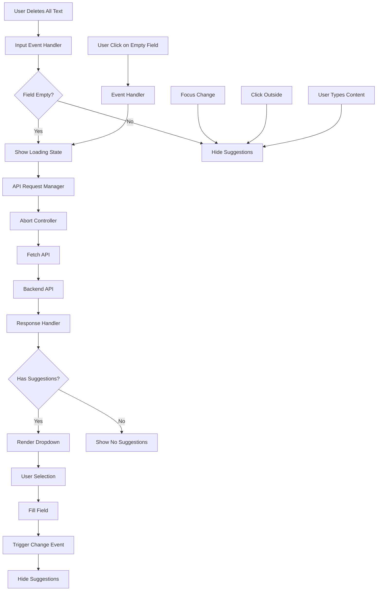
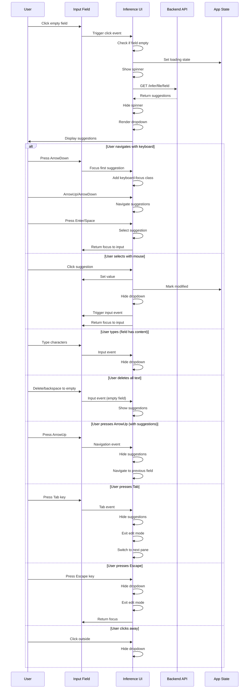

# Metadata Inference System - Frontend Architecture

## Table of Contents

1. [Executive Summary](#executive-summary)
2. [Architecture Overview](#architecture-overview)
3. [UI Components](#ui-components)
4. [Event Handling](#event-handling)
5. [API Communication](#api-communication)
6. [State Management](#state-management)
7. [User Interaction Flow](#user-interaction-flow)
8. [Visual Design](#visual-design)
9. [Performance Optimizations](#performance-optimizations)
10. [Accessibility Features](#accessibility-features)
11. [Error Handling](#error-handling)
12. [Integration Points](#integration-points)
13. [Code References](#code-references)

## Executive Summary

The Metadata Inference System frontend provides an intuitive, non-intrusive interface for metadata suggestions. Built with vanilla JavaScript, the system triggers inference when users click on empty metadata fields or when fields become empty through user editing (e.g., deleting all text), displays confidence-scored suggestions in a dropdown, and seamlessly integrates with the existing metadata editor. The implementation emphasizes performance through request debouncing and cancellation, while maintaining accessibility with keyboard navigation and screen reader support. The system ensures clean navigation by automatically hiding suggestions when users navigate away from fields using arrow keys, and maintains proper focus management by returning focus to the input field after suggestion selection to ensure keyboard navigation continues to work seamlessly.

## Architecture Overview

### System Design



### Key Design Principles

1. **Non-Intrusive UX**: Suggestions appear on empty field clicks or when fields become empty
2. **Progressive Enhancement**: Functions without breaking existing features
3. **Performance First**: Request cancellation and debouncing
4. **Visual Feedback**: Loading states and confidence indicators
5. **Seamless Integration**: Works with existing save/edit workflows

## UI Components

### HTML Structure

The inference UI consists of three main components per field:

```html
<div class="form-group">
    <label for="title">Title</label>
    <div class="input-wrapper">
        <input type="text" id="title" name="title" value="">
        
        <!-- Loading indicator -->
        <div class="inference-loading" id="title-loading" style="display: none;">
            <div class="inference-spinner"></div>
        </div>
        
        <!-- Suggestions dropdown -->
        <div class="inference-suggestions" id="title-suggestions" style="display: none;">
            <!-- Dynamically populated -->
        </div>
    </div>
</div>
```

### Component Creation

Located in `static/js/metadata/editor.js` (lines 590-632):

```javascript
function createFieldElement(field, value, fieldConfig) {
    const formGroup = document.createElement('div');
    formGroup.className = 'form-group';
    formGroup.id = `group-${field}`;
    
    // Create label
    const label = document.createElement('label');
    label.htmlFor = field;
    label.textContent = fieldConfig.display_name || field;
    
    // Create input wrapper for positioning
    const inputWrapper = document.createElement('div');
    inputWrapper.className = 'input-wrapper';
    
    // Create input
    const input = document.createElement(inputType);
    input.type = fieldConfig.type || 'text';
    input.id = field;
    input.name = field;
    input.value = value || '';
    
    // Create inference components
    const loadingDiv = document.createElement('div');
    loadingDiv.className = 'inference-loading';
    loadingDiv.id = `${field}-loading`;
    loadingDiv.style.display = 'none';
    loadingDiv.innerHTML = '<div class="inference-spinner"></div>';
    
    const suggestionsDiv = document.createElement('div');
    suggestionsDiv.className = 'inference-suggestions';
    suggestionsDiv.id = `${field}-suggestions`;
    suggestionsDiv.style.display = 'none';
    
    // Assemble components
    inputWrapper.appendChild(input);
    inputWrapper.appendChild(loadingDiv);
    inputWrapper.appendChild(suggestionsDiv);
    
    formGroup.appendChild(label);
    formGroup.appendChild(inputWrapper);
    
    // Attach inference handlers
    window.metadataInference.attachInferenceHandlers(field);
    
    return formGroup;
}
```

### Inference Module Structure

The main inference module in `static/js/metadata/inference.js`:

```javascript
window.metadataInference = (function() {
    'use strict';
    
    // Module state
    const state = {
        activeRequests: new Map(),
        currentField: null,
        isLoading: false
    };
    
    // Configuration
    const config = {
        apiEndpoint: '/infer',
        debounceDelay: 300,
        minFieldLength: 0,
        maxSuggestions: 5
    };
    
    // Public API
    return {
        init: init,
        attachInferenceHandlers: attachInferenceHandlers,
        hideAllSuggestions: hideAllSuggestions
    };
})();
```

## Event Handling

### Field Click Handler

Triggers inference on empty field click (lines 41-60):

```javascript
function attachInferenceHandlers(field) {
    const input = document.getElementById(field);
    const loadingEl = document.getElementById(`${field}-loading`);
    const suggestionsEl = document.getElementById(`${field}-suggestions`);
    
    if (!input || !loadingEl || !suggestionsEl) return;
    
    // Click handler for empty fields
    input.addEventListener('click', function(e) {
        // Only trigger if field is empty and not already showing suggestions
        if (!input.value.trim() && 
            suggestionsEl.style.display === 'none' &&
            !state.isLoading) {
            showInferenceSuggestions(field);
        }
    });
    
    // Show/hide suggestions based on field content
    input.addEventListener('input', function(e) {
        if (input.value.trim() === '' && !input.disabled && State.currentFile) {
            // Field is now empty, show suggestions
            showInferenceSuggestions(field);
        } else {
            // Field has content, hide suggestions
            hideInferenceSuggestions(field);
        }
    });
    
    // Hide on blur (with delay for suggestion clicks)
    input.addEventListener('blur', function(e) {
        setTimeout(() => {
            if (!suggestionsEl.contains(document.activeElement)) {
                hideInferenceSuggestions(field);
            }
        }, 200);
    });
}
```

### Global Click Handler

Hides suggestions when clicking outside (lines 20-30):

```javascript
function setupInferenceHandlers() {
    // Global click handler to hide suggestions
    document.addEventListener('click', function(e) {
        // If click is outside any suggestion dropdown
        if (!e.target.closest('.inference-suggestions') &&
            !e.target.closest('.form-group input')) {
            hideAllSuggestions();
        }
    });
    
    // ESC key handler
    document.addEventListener('keydown', function(e) {
        if (e.key === 'Escape') {
            hideAllSuggestions();
        }
    });
}
```

### Suggestion Selection

Handles user selection of suggestions (lines 150-170):

```javascript
function handleSuggestionClick(field, value) {
    const input = document.getElementById(field);
    if (!input) return;
    
    // Set the value
    input.value = value;
    
    // Trigger input event for state management
    const event = new Event('input', {
        bubbles: true,
        cancelable: true
    });
    input.dispatchEvent(event);
    
    // Mark field as modified
    input.classList.add('modified');
    
    // Update state
    window.appState.modifiedFields[field] = true;
    
    // Hide suggestions
    hideInferenceSuggestions(field);
    
    // Focus the input
    input.focus();
}
```

## API Communication

### Request Management

The system uses AbortController for request cancellation (lines 62-90):

```javascript
async function showInferenceSuggestions(field) {
    const input = document.getElementById(field);
    const loadingEl = document.getElementById(`${field}-loading`);
    const suggestionsEl = document.getElementById(`${field}-suggestions`);
    
    if (!input || !loadingEl || !suggestionsEl) return;
    
    // Cancel any existing request for this field
    if (state.activeRequests.has(field)) {
        state.activeRequests.get(field).abort();
    }
    
    // Create new abort controller
    const abortController = new AbortController();
    state.activeRequests.set(field, abortController);
    
    // Show loading state
    loadingEl.style.display = 'block';
    state.isLoading = true;
    state.currentField = field;
    
    try {
        // Get current file path
        const filePath = window.appState.currentFile;
        if (!filePath) {
            throw new Error('No file selected');
        }
        
        // Make API request
        const response = await fetch(
            `/infer/${encodeURIComponent(filePath)}/${field}`,
            {
                signal: abortController.signal,
                headers: {
                    'Accept': 'application/json'
                }
            }
        );
        
        if (!response.ok) {
            throw new Error(`HTTP ${response.status}`);
        }
        
        const suggestions = await response.json();
        
        // Display suggestions
        displaySuggestions(field, suggestions);
        
    } catch (error) {
        if (error.name !== 'AbortError') {
            console.error('Inference error:', error);
            showError(field, 'Error loading suggestions');
        }
    } finally {
        // Clean up
        loadingEl.style.display = 'none';
        state.isLoading = false;
        state.activeRequests.delete(field);
    }
}
```

### Response Handling

Processes and validates API responses:

```javascript
function validateSuggestions(suggestions) {
    if (!Array.isArray(suggestions)) {
        console.error('Invalid suggestions format');
        return [];
    }
    
    return suggestions.filter(suggestion => {
        return suggestion &&
               typeof suggestion.value === 'string' &&
               typeof suggestion.confidence === 'number' &&
               suggestion.confidence >= 0 &&
               suggestion.confidence <= 100;
    });
}
```

## State Management

### Global State Integration

The inference system integrates with the app's global state (`static/js/state.js`):

```javascript
window.appState = {
    // Existing state
    currentFile: null,
    currentFolder: null,
    modifiedFields: {},
    
    // Inference-specific state
    inferenceActive: {},            // Track active inference by field
    inferenceAbortControllers: {},  // Store abort controllers
    lastInferenceResults: {},       // Cache last results per field
    
    // Methods
    clearInferenceState: function() {
        // Abort all active requests
        Object.values(this.inferenceAbortControllers).forEach(controller => {
            controller.abort();
        });
        
        this.inferenceActive = {};
        this.inferenceAbortControllers = {};
        this.lastInferenceResults = {};
    }
};
```

### Request State Tracking

Prevents duplicate requests and manages cancellation:

```javascript
function isInferenceActive(field) {
    return window.appState.inferenceActive[field] || false;
}

function setInferenceActive(field, active, controller = null) {
    window.appState.inferenceActive[field] = active;
    
    if (controller) {
        window.appState.inferenceAbortControllers[field] = controller;
    } else if (!active) {
        delete window.appState.inferenceAbortControllers[field];
    }
}
```

## User Interaction Flow

### Complete Interaction Sequence



### Visual Feedback States

1. **Initial State**: Empty field, no visual indicators
2. **Loading State**: Spinner appears in field
3. **Suggestions State**: Dropdown with confidence bars
4. **Selected State**: Field populated, marked as modified
5. **Error State**: Error message in dropdown

### Empty Field Through Editing Behavior

The inference system now supports showing suggestions when a field becomes empty through user editing:

1. **Delete All Text**: User selects all text and deletes → suggestions appear
2. **Backspace to Empty**: User backspaces until field is empty → suggestions appear
3. **Cut to Empty**: User cuts all text from field → suggestions appear
4. **Paste Empty**: User pastes empty string → suggestions appear

This behavior ensures consistent user experience whether:
- Starting with an empty field (click to show suggestions)
- Creating an empty field through editing (automatic suggestion display)

The same conditions apply:
- Field must be truly empty (whitespace trimmed)
- Input must not be disabled
- A file must be currently selected (`State.currentFile`)

## Keyboard Navigation

### Navigation Implementation

The inference system now includes comprehensive keyboard navigation support:

#### Key Integration Overview

The inference system integrates with multiple keyboard handlers to ensure proper cleanup when navigating away from fields:

##### Arrow Key Integration (keyboard.js:258-291)

When editing a metadata field with arrow keys:

```javascript
if ((e.key === 'ArrowUp' || e.key === 'ArrowDown') && isEditing) {
    e.preventDefault();
    
    // Check if inference suggestions are active for this field
    const fieldId = e.target.id;
    const suggestionsEl = document.getElementById(`${fieldId}-suggestions`);
    const hasSuggestions = suggestionsEl && 
                          suggestionsEl.classList.contains('active') && 
                          suggestionsEl.querySelectorAll('.suggestion-item').length > 0;
    
    if (hasSuggestions && e.key === 'ArrowDown') {
        // Navigate into suggestions
        const firstSuggestion = suggestionsEl.querySelector('.suggestion-item');
        if (firstSuggestion) {
            firstSuggestion.focus();
            firstSuggestion.classList.add('keyboard-focus');
        }
        return;
    }
    
    // Otherwise, proceed with normal navigation
    // Hide inference suggestions if they are active
    if (hasSuggestions) {
        window.MetadataRemote.Metadata.Inference.hideInferenceSuggestions(fieldId);
    }
    
    // Transition back to normal state
    StateMachine.transition(StateMachine.States.NORMAL);
    e.target.dataset.editing = 'false';
    e.target.readOnly = true;
    this.navigateMetadata(e.key);
    return;
}
```

##### Escape Key Integration (keyboard.js:231-252)

The Escape key handler includes inference suggestion cleanup:

```javascript
if (e.key === 'Escape' && isEditing) {
    e.preventDefault();
    
    // Check if inference suggestions are active for this field
    const fieldId = e.target.id;
    const suggestionsEl = document.getElementById(`${fieldId}-suggestions`);
    const hasSuggestions = suggestionsEl && suggestionsEl.classList.contains('active');
    
    // Hide inference suggestions if they are active
    if (hasSuggestions && window.MetadataRemote.Metadata.Inference) {
        window.MetadataRemote.Metadata.Inference.hideInferenceSuggestions(fieldId);
    }
    
    // Transition back to normal state and exit edit mode
    StateMachine.transition(StateMachine.States.NORMAL);
    e.target.dataset.editing = 'false';
    e.target.readOnly = true;
    return;
}
```

##### Tab Key Integration (pane-navigation.js:103-131)

The Tab key handler in pane navigation ensures suggestions are hidden before switching panes:

```javascript
Router.register(
    { key: 'Tab', state: 'form_edit', context: '*', target: '*' },
    (event) => {
        event.preventDefault();
        
        // Exit edit mode if currently editing a metadata field
        if (event.target.tagName === 'INPUT' && event.target.dataset.editing === 'true') {
            // Check if inference suggestions are active for this field
            const fieldId = event.target.id;
            const suggestionsEl = document.getElementById(`${fieldId}-suggestions`);
            const hasSuggestions = suggestionsEl && suggestionsEl.classList.contains('active');
            
            // Hide inference suggestions if they are active
            if (hasSuggestions && window.MetadataRemote.Metadata.Inference) {
                window.MetadataRemote.Metadata.Inference.hideInferenceSuggestions(fieldId);
            }
            
            event.target.dataset.editing = 'false';
            event.target.readOnly = true;
        }
        
        // Transition back to normal state and switch panes
        StateMachine.transition(StateMachine.States.NORMAL);
        this.switchPanes();
    },
    { priority: 60 }
);
```

#### Suggestion Navigation (inference.js:138-223)

Each suggestion item includes keyboard event handlers:

```javascript
item.addEventListener('keydown', (e) => {
    const suggestions = container.querySelectorAll('.suggestion-item');
    const currentIndex = Array.from(suggestions).indexOf(item);
    
    if (e.key === 'ArrowDown') {
        e.preventDefault();
        if (currentIndex < suggestions.length - 1) {
            suggestions[currentIndex + 1].focus();
            suggestions[currentIndex + 1].classList.add('keyboard-focus');
            item.classList.remove('keyboard-focus');
        }
    } else if (e.key === 'ArrowUp') {
        e.preventDefault();
        if (currentIndex > 0) {
            suggestions[currentIndex - 1].focus();
            suggestions[currentIndex - 1].classList.add('keyboard-focus');
            item.classList.remove('keyboard-focus');
        } else {
            // Go back to input field
            const input = document.getElementById(field);
            input.focus();
            input.dataset.editing = 'true';
            input.readOnly = false;
            container.querySelectorAll('.suggestion-item').forEach(s => {
                s.classList.remove('keyboard-focus');
            });
        }
    } else if (e.key === 'Enter' || e.key === ' ') {
        e.preventDefault();
        item.click();
    } else if (e.key === 'Escape') {
        e.preventDefault();
        this.hideInferenceSuggestions(field);
        const input = document.getElementById(field);
        input.focus();
    }
});
```

### Keyboard Navigation Features

1. **Entering Suggestions**:
   - Press `ArrowDown` while in an input field with active suggestions
   - Focuses the first suggestion item
   - Adds visual focus indicator

2. **Navigating Within Suggestions**:
   - `ArrowDown`: Move to next suggestion
   - `ArrowUp`: Move to previous suggestion or back to input field
   - Circular navigation prevented at boundaries
   - Visual focus indicator follows navigation

3. **Selecting Suggestions**:
   - `Enter` or `Space`: Select the focused suggestion
   - Populates the field and hides dropdown
   - Triggers appropriate change events

4. **Exiting Suggestions**:
   - `Escape`: Close dropdown and return focus to input (also exits edit mode)
   - `Tab`: Hide suggestions, exit edit mode, and switch to next pane
   - `ArrowUp` from first suggestion: Return to input field
   - `ArrowUp` from input field: Hide suggestions and navigate to previous field
   - Input field re-enters edit mode when returning from suggestions

### Focus Management

The system maintains proper focus state throughout navigation:

```javascript
// Focus handler for visual feedback
item.addEventListener('focus', () => {
    container.querySelectorAll('.suggestion-item').forEach(s => {
        s.classList.remove('keyboard-focus');
    });
    item.classList.add('keyboard-focus');
});
```

### Accessibility Attributes

Suggestion items include proper ARIA attributes for screen reader support:

```javascript
const item = document.createElement('div');
item.className = 'suggestion-item';
item.setAttribute('tabindex', '0');
item.setAttribute('role', 'option');
item.setAttribute('aria-selected', 'false');
```

## Visual Design

### CSS Implementation

The visual design is defined in `static/css/main.css`:

```css
/* Input wrapper for positioning */
.input-wrapper {
    position: relative;
    width: 100%;
}

/* Loading spinner */
.inference-loading {
    position: absolute;
    right: 10px;
    top: 50%;
    transform: translateY(-50%);
    width: 16px;
    height: 16px;
}

.inference-spinner {
    width: 16px;
    height: 16px;
    border: 2px solid rgba(255, 255, 255, 0.1);
    border-top-color: var(--primary-color);
    border-radius: 50%;
    animation: spin 0.8s linear infinite;
}

@keyframes spin {
    to { transform: rotate(360deg); }
}

/* Suggestions dropdown */
.inference-suggestions {
    position: absolute;
    top: 100%;
    left: 0;
    right: 0;
    margin-top: 4px;
    background: var(--bg-secondary);
    border: 1px solid var(--border-color);
    border-radius: 8px;
    box-shadow: 0 4px 12px rgba(0, 0, 0, 0.3);
    max-height: 300px;
    overflow-y: auto;
    z-index: 1000;
}

/* Suggestion items */
.inference-suggestion {
    padding: 12px 16px;
    cursor: pointer;
    transition: background-color 0.2s;
    border-bottom: 1px solid rgba(255, 255, 255, 0.05);
}

.inference-suggestion:hover {
    background-color: rgba(255, 255, 255, 0.05);
}

.inference-suggestion:last-child {
    border-bottom: none;
}

/* Keyboard focus styles */
.suggestion-item:focus,
.suggestion-item.keyboard-focus {
    outline: 1px solid var(--accent-primary);
    outline-offset: -2px;
    background: var(--bg-hover);
    padding-left: 1.25rem;
}

.suggestion-item:focus {
    outline: none;
}

.suggestion-item.keyboard-focus {
    outline: 1px solid var(--accent-primary);
}

/* Suggestion content */
.suggestion-value {
    font-size: 14px;
    color: var(--text-primary);
    margin-bottom: 4px;
}

.suggestion-confidence {
    display: flex;
    align-items: center;
    gap: 8px;
    font-size: 12px;
    color: var(--text-secondary);
}

/* Confidence bar */
.confidence-bar {
    flex: 1;
    height: 4px;
    background: rgba(255, 255, 255, 0.1);
    border-radius: 2px;
    overflow: hidden;
}

.confidence-fill {
    height: 100%;
    background: var(--accent-primary);
    transition: width 0.3s ease;
}

### Light Theme Overrides

The inference system includes comprehensive light theme styling (lines 3310-3334):

```css
/* Inference suggestions dropdown - Light theme overrides */
:root[data-theme="light"] .inference-suggestions {
    background: var(--dropdown-bg);  /* #f4f1de */
    border: 1px solid var(--dropdown-border);  /* #c1a55f */
    box-shadow: 0 0 0 3px rgba(208, 140, 96, 0.1), var(--dropdown-shadow);
}

:root[data-theme="light"] .suggestion-item {
    border-bottom: 1px solid rgba(193, 165, 95, 0.1);
}

:root[data-theme="light"] .suggestion-item:hover {
    background: var(--dropdown-item-hover);  /* #e8e2c5 */
}

:root[data-theme="light"] .suggestion-item:focus,
:root[data-theme="light"] .suggestion-item.keyboard-focus {
    background: var(--dropdown-item-focus-bg);  /* rgba(208, 140, 96, 0.15) */
}

:root[data-theme="light"] .confidence-bar {
    background: rgba(193, 165, 95, 0.2);
}
```

### Theme Integration

The inference dropdown follows the application's theme system design patterns:

1. **Dark Theme (Default)**:
   - Deep blue-gray backgrounds (`#1a1d2a`)
   - Subtle white borders with low opacity
   - Blue accent glow effects
   - High contrast for readability

2. **Light Theme**:
   - Cream-colored backgrounds (`#f4f1de`)
   - Warm brown borders (`#c1a55f`)
   - Orange-brown accent colors
   - Optimized contrast for light backgrounds

3. **Theme Variables Used**:
   - `--dropdown-bg`: Background color for dropdowns
   - `--dropdown-border`: Border color for dropdowns
   - `--dropdown-item-hover`: Hover state background
   - `--dropdown-item-focus-bg`: Focus state background
   - `--accent-primary`: Primary accent color

The theme switching is handled automatically by the application's theme toggle system, ensuring consistent appearance across all UI components.

/* Evidence text */
.suggestion-evidence {
    font-size: 11px;
    color: var(--text-tertiary);
    margin-top: 4px;
}

/* No suggestions message */
.no-suggestions {
    padding: 16px;
    text-align: center;
    color: var(--text-secondary);
    font-size: 14px;
}

/* Error state */
.inference-error {
    padding: 16px;
    text-align: center;
    color: var(--error-color);
    font-size: 14px;
}
```

### Suggestion Rendering

The dropdown is dynamically generated (lines 122-179):

```javascript
function displaySuggestions(field, suggestions) {
    const container = document.getElementById(`${field}-suggestions`);
    if (!container) return;
    
    // Clear existing content
    container.innerHTML = '';
    container.classList.add('active');
    
    if (!suggestions || suggestions.length === 0) {
        // No suggestions message
        const message = document.createElement('div');
        message.className = 'no-suggestions';
        message.textContent = 'No suggestions available';
        container.appendChild(message);
    } else {
        // Render each suggestion
        suggestions.forEach((suggestion, index) => {
            const item = document.createElement('div');
            item.className = 'suggestion-item';
            item.setAttribute('tabindex', '0');
            item.setAttribute('role', 'option');
            item.setAttribute('aria-selected', 'false');
            
            // Value display
            const value = document.createElement('div');
            value.className = 'suggestion-value';
            value.textContent = suggestion.value;
            
            // Confidence display
            const confidence = document.createElement('div');
            confidence.className = 'suggestion-confidence';
            
            const bar = document.createElement('div');
            bar.className = 'confidence-bar';
            const fill = document.createElement('div');
            fill.className = 'confidence-fill';
            fill.style.width = `${suggestion.confidence}%`;
            bar.appendChild(fill);
            
            const text = document.createElement('span');
            text.textContent = `${suggestion.confidence}%`;
            
            confidence.appendChild(bar);
            confidence.appendChild(text);
            
            item.appendChild(value);
            item.appendChild(confidence);
            
            // Click handler
            item.addEventListener('click', () => {
                document.getElementById(field).value = suggestion.value;
                this.hideInferenceSuggestions(field);
                
                // Trigger input event to update apply controls
                const event = new Event('input', { bubbles: true });
                document.getElementById(field).dispatchEvent(event);
                
                // Return focus to the input field
                document.getElementById(field).focus();
            });
            
            // Keyboard navigation handler (omitted for brevity)
            
            container.appendChild(item);
        });
    }
    
    // Show dropdown
    container.style.display = 'block';
}
```

## Performance Optimizations

### Request Debouncing

While not currently implemented, the system is designed to support debouncing:

```javascript
function debounce(func, wait) {
    let timeout;
    return function executedFunction(...args) {
        const later = () => {
            clearTimeout(timeout);
            func(...args);
        };
        clearTimeout(timeout);
        timeout = setTimeout(later, wait);
    };
}

// Could be applied to inference triggers
const debouncedInference = debounce(showInferenceSuggestions, 300);
```

### Request Cancellation

Prevents race conditions with AbortController:

```javascript
function cancelActiveRequest(field) {
    const controller = window.appState.inferenceAbortControllers[field];
    if (controller) {
        controller.abort();
        delete window.appState.inferenceAbortControllers[field];
        delete window.appState.inferenceActive[field];
    }
}
```

### DOM Update Batching

Efficient suggestion rendering:

```javascript
function renderSuggestionsBatch(suggestions, container) {
    // Create document fragment for batch insertion
    const fragment = document.createDocumentFragment();
    
    suggestions.forEach((suggestion, index) => {
        const element = createSuggestionElement(suggestion, field, index);
        fragment.appendChild(element);
    });
    
    // Single DOM update
    container.innerHTML = '';
    container.appendChild(fragment);
}
```

## Accessibility Features

### ARIA Implementation

The system includes comprehensive ARIA attributes:

```javascript
function setupAccessibility(field, suggestionsEl) {
    const input = document.getElementById(field);
    
    // Set ARIA attributes
    input.setAttribute('role', 'combobox');
    input.setAttribute('aria-autocomplete', 'list');
    input.setAttribute('aria-expanded', 'false');
    input.setAttribute('aria-controls', `${field}-suggestions`);
    
    suggestionsEl.setAttribute('role', 'listbox');
    suggestionsEl.setAttribute('aria-label', `Suggestions for ${field}`);
}

function updateAriaState(field, expanded) {
    const input = document.getElementById(field);
    input.setAttribute('aria-expanded', expanded.toString());
}
```

### Keyboard Navigation

Support for keyboard-only users:

```javascript
function handleKeyboardNavigation(field, event) {
    const suggestionsEl = document.getElementById(`${field}-suggestions`);
    const suggestions = suggestionsEl.querySelectorAll('.inference-suggestion');
    let currentIndex = Array.from(suggestions).findIndex(s => 
        s.getAttribute('aria-selected') === 'true'
    );
    
    switch(event.key) {
        case 'ArrowDown':
            event.preventDefault();
            currentIndex = Math.min(currentIndex + 1, suggestions.length - 1);
            break;
            
        case 'ArrowUp':
            event.preventDefault();
            currentIndex = Math.max(currentIndex - 1, 0);
            break;
            
        case 'Enter':
            if (currentIndex >= 0) {
                event.preventDefault();
                suggestions[currentIndex].click();
            }
            break;
            
        case 'Escape':
            event.preventDefault();
            hideInferenceSuggestions(field);
            break;
    }
    
    // Update selection
    suggestions.forEach((s, i) => {
        s.setAttribute('aria-selected', i === currentIndex ? 'true' : 'false');
        if (i === currentIndex) {
            s.focus();
        }
    });
}
```

### Screen Reader Support

Announcements for state changes:

```javascript
function announceToScreenReader(message) {
    const announcement = document.createElement('div');
    announcement.setAttribute('role', 'status');
    announcement.setAttribute('aria-live', 'polite');
    announcement.className = 'sr-only';
    announcement.textContent = message;
    
    document.body.appendChild(announcement);
    
    // Remove after announcement
    setTimeout(() => {
        document.body.removeChild(announcement);
    }, 1000);
}

// Usage
announceToScreenReader(`${suggestions.length} suggestions available for ${field}`);
```

## Error Handling

### Network Error Handling

Graceful handling of API failures:

```javascript
async function handleInferenceRequest(field) {
    try {
        const response = await fetch(url, options);
        
        if (!response.ok) {
            if (response.status === 404) {
                throw new Error('File not found');
            } else if (response.status === 400) {
                throw new Error('Invalid field');
            } else if (response.status >= 500) {
                throw new Error('Server error');
            } else {
                throw new Error(`Request failed: ${response.status}`);
            }
        }
        
        return await response.json();
        
    } catch (error) {
        if (error.name === 'AbortError') {
            // Request was cancelled - no error handling needed
            return null;
        } else if (error.name === 'TypeError' && error.message.includes('fetch')) {
            // Network error
            showError(field, 'Network error. Please check your connection.');
        } else {
            // Other errors
            showError(field, error.message || 'Error loading suggestions');
        }
        
        return null;
    }
}
```

### Error Display

User-friendly error messages:

```javascript
function showError(field, message) {
    const suggestionsEl = document.getElementById(`${field}-suggestions`);
    if (!suggestionsEl) return;
    
    suggestionsEl.innerHTML = '';
    
    const errorDiv = document.createElement('div');
    errorDiv.className = 'inference-error';
    errorDiv.textContent = message;
    
    suggestionsEl.appendChild(errorDiv);
    suggestionsEl.style.display = 'block';
    
    // Auto-hide after delay
    setTimeout(() => {
        hideInferenceSuggestions(field);
    }, 5000);
}
```

### Validation and Sanitization

Input validation before API calls:

```javascript
function validateField(field) {
    const validFields = [
        'title', 'artist', 'album', 'albumartist',
        'date', 'genre', 'track', 'disc', 'composer'
    ];
    
    return validFields.includes(field);
}

function sanitizeFilePath(path) {
    // Remove any potentially dangerous characters
    return path.replace(/[<>:"\\|?*]/g, '');
}
```

## Integration Points

### Metadata Editor Integration

The inference system integrates seamlessly with the metadata editor:

1. **Field Creation**: Handlers attached during field rendering
2. **Value Updates**: Triggers standard input events
3. **State Sync**: Updates global modified fields state
4. **Save Integration**: Works with existing save mechanisms

### History System Integration

While inference doesn't create history entries, selected values integrate with the history system:

```javascript
function applySuggestion(field, value) {
    const input = document.getElementById(field);
    const oldValue = input.value;
    
    // Set new value
    input.value = value;
    
    // Mark as modified for history tracking
    window.appState.modifiedFields[field] = true;
    
    // Trigger change event for other systems
    const event = new Event('change', {
        bubbles: true,
        cancelable: true
    });
    input.dispatchEvent(event);
}
```

### Save System Integration

Modified fields from inference are included in save operations:

```javascript
// In save handler
const modifiedData = {};
for (const field in window.appState.modifiedFields) {
    if (window.appState.modifiedFields[field]) {
        const input = document.getElementById(field);
        if (input) {
            modifiedData[field] = input.value;
        }
    }
}
```

## Code References

### Core Files

- **Inference Module**: `static/js/metadata/inference.js`
  - Main module: Lines 1-200
  - `attachInferenceHandlers()`: Lines 41-61 (includes updated input handler)
  - Input event handler (show/hide logic): Lines 52-61
  - `showInferenceSuggestions()`: Lines 62-120
  - `displaySuggestions()`: Lines 122-179 (includes keyboard handlers and focus management)
  - Keyboard navigation handler: Lines 138-223
  - `hideInferenceSuggestions()`: Lines 250-256 (includes focus cleanup)

- **Keyboard Integration**: 
  - **keyboard.js**:
    - Arrow key handler modification: Lines 258-291
    - Escape key handler with inference: Lines 231-252
    - Inference suggestion detection: Lines 262-272
    - Suggestion cleanup on navigation: Lines 278-281
  - **pane-navigation.js**:
    - Tab key handler with inference: Lines 103-131

- **Editor Integration**: `static/js/metadata/editor.js`
  - Field creation: Lines 590-632
  - Inference attachment: Line 630

- **State Management**: `static/js/state.js`
  - Inference state: Lines 80-81
  - State methods: Lines 150-165

### CSS Styling

- **Main Styles**: `static/css/main.css`
  - Loading spinner: Lines 1815-1821
  - Suggestions dropdown: Lines 1895-1910
  - Confidence bars: Lines 1920-1935
  - Animations: Lines 1940-1950

### Supporting Modules

- **API Module**: `static/js/api.js`
  - Fetch wrapper: Lines 45-80
  - Error handling: Lines 120-140

- **UI Utilities**: `static/js/ui/utils.js`
  - DOM helpers: Lines 200-250
  - Event utilities: Lines 300-320

### Integration Points

- **Save Handlers**: `static/js/metadata/save.js`
  - Individual save: Lines 45-120
  - Batch save: Lines 200-280

- **Keyboard Navigation**: `static/js/keyboard.js`
  - Global handlers: Lines 500-600
  - Focus management: Lines 650-700

---

*This comprehensive documentation covers the complete frontend implementation of the Metadata Inference System, detailing its architecture, user experience design, and integration with the broader application ecosystem.*