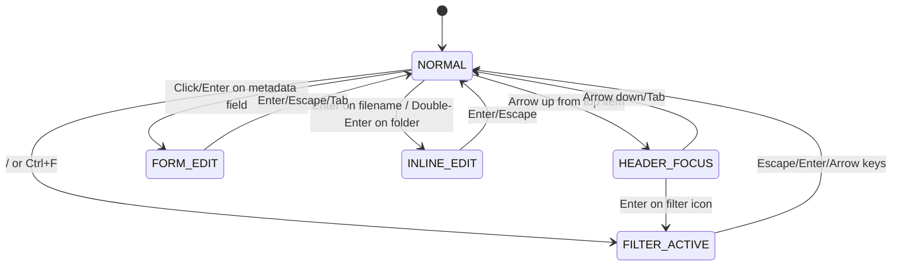
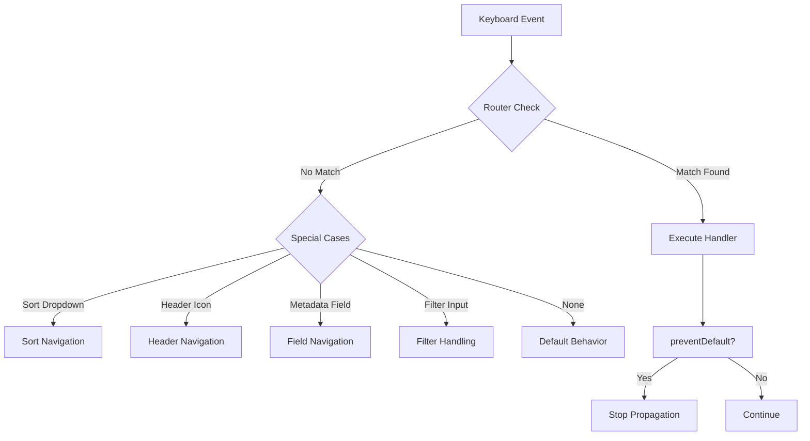

# Keyboard Controls Architecture - Metadata Remote

## Table of Contents

1. [Executive Summary](#executive-summary)
2. [Architecture Overview](#architecture-overview)
3. [Complete Keyboard Shortcut Reference](#complete-keyboard-shortcut-reference)
4. [State Machine System](#state-machine-system)
5. [Navigation Contexts](#navigation-contexts)
6. [Keyboard Event Flow](#keyboard-event-flow)
7. [Focus Management System](#focus-management-system)
8. [Key Components Analysis](#key-components-analysis)
9. [Code Examples and Implementation Details](#code-examples-and-implementation-details)
10. [Accessibility Features](#accessibility-features)
11. [ARIA Support Analysis](#aria-support-analysis)
12. [Recommendations for Improvements](#recommendations-for-improvements)

## Executive Summary

The Metadata Remote keyboard control system is a sophisticated navigation framework built around a state machine architecture and modular context system. It provides comprehensive keyboard navigation across three main panes (folders, files, metadata) with full support for filtering, sorting, editing, and audio playback controls.

Key architectural highlights:
- **State Machine**: Manages 5 distinct navigation states with controlled transitions
- **Router Pattern**: Centralized keyboard event routing with priority-based handling
- **Context System**: Modular navigation contexts for different UI areas
- **Focus Management**: Sophisticated focus tracking with history, visibility management, and pane focus preservation
- **Key Repeat**: Custom key repeat handler for smooth list navigation
- **Inference Integration**: Seamless navigation with automatic suggestion cleanup when leaving fields via arrow keys, Escape, or Tab; focus returns to input after suggestion selection
- **Field Deletion**: SHIFT+DELETE for quick field removal with keyboard-navigable confirmation UI and preserved metadata pane focus
- **Oversized Fields**: Special handling prevents edit mode, opens modal interface instead with automatic transitions based on character count
- **Audio Control**: Space bar integration for play/pause functionality
- **Accessibility**: ARIA attributes and screen reader support

The system achieves excellent keyboard accessibility with over 40 keyboard shortcuts, complete tab navigation, proper focus indicators throughout the interface, and audio playback control.

## Architecture Overview

### Core Components

1. **`keyboard.js`** (1199 lines) - Main keyboard controller
   - Initializes all navigation modules
   - Manages global keyboard event handlers
   - Coordinates between different navigation contexts
   - Handles special cases like filename editing

2. **`router.js`** (271 lines) - Event routing system
   - Pattern-based route matching
   - Priority-based handler execution
   - Context-aware routing decisions
   - Modifier key support

3. **`state-machine.js`** (164 lines) - Navigation state management
   - 5 defined states with transition rules
   - Event emission for state changes
   - Context preservation across transitions

4. **Navigation Contexts** (4 modules)
   - `pane-navigation.js` - Tab switching between panes
   - `list-navigation.js` - Arrow/page navigation in lists
   - `form-navigation.js` - Metadata field navigation
   - `header-navigation.js` - Header icon navigation

5. **Utilities**
   - `focus-manager.js` - Focus tracking and visibility
   - `keyboard-utils.js` - Key repeat and scroll management

## Complete Keyboard Shortcut Reference

### Global Shortcuts

| Shortcut | Action | State | Code Reference |
|----------|--------|-------|----------------|
| `Tab` | Switch between panes | normal | `pane-navigation.js:66-73` |
| `?` | Show help dialog | any | `app.js:204-210` |
| `/` | Toggle filter (current pane) | normal | `keyboard.js:424-434` |
| `Ctrl+F` | Toggle filter (current pane) | normal | `keyboard.js:436-442` |
| `Ctrl+Shift+S` | Reverse sort order | normal | `keyboard.js:354-358` |
| `Alt+T` / `Option+T` (Mac) | Toggle theme (dark/light) | any | `theme-toggle.js:168-178` |
| `Escape` | Close modal (field edit, help, etc.) | modal open | `field-edit-modal.js:91-96` |

### List Navigation (Folders/Files)

| Shortcut | Action | Context | Code Reference |
|----------|--------|---------|----------------|
| `↑` / `↓` | Navigate items | folders/files | `list-navigation.js:51-60` |
| `PageUp` / `PageDown` | Jump by page | folders/files | `list-navigation.js:63-72` |
| `Enter` | Expand folder / Play file | folders/files | `list-navigation.js:75-82` |
| `Double-Enter` | Rename folder | folders | `list-navigation.js:442-495` |
| `←` / `→` | Navigate header icons | header focus | `keyboard.js:955-1001` |
| `Space` | Toggle audio playback | files (with selection) | `list-navigation.js:65-74` |

### Metadata Pane Navigation

| Shortcut | Action | Context | Code Reference |
|----------|--------|---------|----------------|
| `↑` / `↓` | Navigate fields | metadata | `keyboard.js:457-733` |
| `←` / `→` | Navigate grouped fields | metadata | `keyboard.js:684-719` |
| `Enter` | Edit field / Save / Open modal (oversized button) | metadata field | `keyboard.js:199-230` |
| `Escape` | Cancel edit, hide inference suggestions | editing | `keyboard.js:231-252` |
| `Tab` | Exit edit, hide inference suggestions & switch pane | editing | `pane-navigation.js:103-131` |
| `Shift+Delete` | Delete field (with confirmation) | metadata field | `keyboard.js:495-515` |

### Oversized Field Navigation

Oversized fields (>100 characters) have special keyboard behavior with automatic transitions:

| Shortcut | Action | Context | Code Reference |
|----------|--------|---------|----------------|
| `Enter` | Open field edit modal | oversized field button | `keyboard.js:356-361` |
| `Click` | Open field edit modal | oversized field button | Button click handler |
| `Tab` | Skip to next field | oversized field button | Standard tab behavior |
| `↑` / `↓` | Navigate between fields normally | oversized field button | Standard navigation |
| `Type beyond 100 chars` | Auto-transition to modal | inline editing | `transition-controller.js:184-207` |
| `Delete below 80 chars` | Auto-return to inline | modal editing | `transition-controller.js:285-336` |

Key implementation details:
- Oversized fields are displayed as buttons with `oversized-field-button` class
- Button shows centered "Click to view/edit" text
- Light mode buttons have darker, bolder text (#3a3222, font-weight: 600)
- Enter key triggers button click to open modal
- Modal provides full editing capabilities with apply to file/folder options
- Frontend-only detection based on actual field value length (≥100 characters)
- **Automatic Transitions**: TransitionController monitors character count during typing
  - Seamlessly transitions to modal when exceeding 100 characters
  - Returns to inline editing when falling below 80 characters (hysteresis)
  - Immediate transitions on large paste operations
  - Cursor position preserved across all transitions

**Note**: For comprehensive documentation on the modal editing feature, see **[Modal Editing Feature Analysis](./modal-editing.md)**.

### Inference Suggestion Navigation

| Shortcut | Action | Context | Code Reference |
|----------|--------|---------|----------------|
| `↓` | Enter suggestions (from input) | editing with suggestions | `keyboard.js:268-275` |
| `↑` | Navigate to previous field & hide suggestions | editing with suggestions | `keyboard.js:278-281` |
| `Escape` | Hide suggestions & exit edit mode | editing with suggestions | `keyboard.js:231-252` |
| `Tab` | Hide suggestions, exit edit mode & switch pane | editing with suggestions | `pane-navigation.js:103-131` |
| `↑` / `↓` | Navigate between suggestions | suggestion dropdown | `inference.js:141-164` |
| `↑` | Return to input (from first suggestion) | suggestion dropdown | `inference.js:156-164` |
| `Enter` | Select suggestion (focus returns to input) | suggestion dropdown | `inference.js:166-169` |
| `Space` | Select suggestion (focus returns to input) | suggestion dropdown | `inference.js:166-169` |
| `Click` | Select suggestion (focus returns to input) | suggestion dropdown | `inference.js:169-179` |
| `Escape` | Close suggestions | suggestion dropdown | `inference.js:169-174` |

### Filter Input Controls

| Shortcut | Action | Context | Code Reference |
|----------|--------|---------|----------------|
| `↑` | Go to help icon | filter input | `keyboard.js:314-316` |
| `↓` | Go to first list item | filter input | `keyboard.js:310-312` |
| `←` | Go to filter icon | filter input | `keyboard.js:317-319` |
| `→` | Go to sort icon | filter input | `keyboard.js:321-323` |
| `Escape` / `Enter` | Close filter | filter input | `keyboard.js:325-342` |

### Sort Dropdown Navigation

| Shortcut | Action | Context | Code Reference |
|----------|--------|---------|----------------|
| `↑` / `↓` | Navigate options | sort dropdown | `keyboard.js:1098-1122` |
| `Enter` | Select option | sort dropdown | `keyboard.js:1123-1136` |
| `Escape` | Close dropdown | sort dropdown | `keyboard.js:1137-1145` |
| `Tab` | Close & continue | sort dropdown | `keyboard.js:1145-1162` |

### Field Deletion Confirmation Navigation

When triggered by SHIFT+DELETE, the field deletion confirmation UI provides keyboard navigation:

| Shortcut | Action | Context | Code Reference |
|----------|--------|---------|----------------|
| `←` | Navigate from folder to file button | deletion confirmation | `editor.js:1241-1247` |
| `→` | Navigate from file to folder button | deletion confirmation | `editor.js:1249-1255` |
| `↓` | Cancel deletion and return focus to field | deletion confirmation | `editor.js:1257-1267` |
| `↑` | Cancel deletion and navigate to previous field | deletion confirmation | `editor.js:1269-1282` |
| `Escape` | Cancel deletion and return focus to field | deletion confirmation | `editor.js:1257-1267` |
| `Enter` | Confirm selected action (file/folder) | deletion confirmation | (default button behavior) |

The confirmation UI automatically focuses the "file" button when opened, allowing immediate confirmation with Enter or navigation with arrow keys.

**Important Bug Fix**: The general keyboard navigation handler in `keyboard.js` includes a check to skip navigation for delete confirmation buttons (lines 190-193). This prevents the general `navigateMetadata()` function from intercepting arrow key events that should be handled by the confirmation-specific navigation handler. Without this check, arrow keys would trigger incorrect navigation behavior (jumping to unrelated fields) instead of moving between the file/folder buttons.

**UI Enhancement for Grouped Fields**: The confirmation UI for grouped fields (Track #, Disc #, Year) now appears between the label and input field rather than in the label area. This positioning prevents overlap issues that previously made the confirmation difficult to use. The keyboard navigation behavior remains unchanged, but the improved positioning makes the interface more accessible.

## State Machine System

### Navigation States

```javascript
// From state-machine.js:11-17
const NavigationStates = {
    NORMAL: 'normal',              // Standard navigation
    HEADER_FOCUS: 'header_focus',  // Navigating header icons
    FILTER_ACTIVE: 'filter_active',// Filter input is active
    FORM_EDIT: 'form_edit',        // Editing metadata field
    INLINE_EDIT: 'inline_edit'     // Inline editing (filename/folder)
};
```

### State Transition Rules

```javascript
// From state-machine.js:19-39
const TransitionRules = {
    [NavigationStates.NORMAL]: [
        NavigationStates.HEADER_FOCUS,
        NavigationStates.FILTER_ACTIVE,
        NavigationStates.FORM_EDIT,
        NavigationStates.INLINE_EDIT
    ],
    [NavigationStates.HEADER_FOCUS]: [
        NavigationStates.NORMAL,
        NavigationStates.FILTER_ACTIVE
    ],
    [NavigationStates.FILTER_ACTIVE]: [
        NavigationStates.NORMAL
    ],
    [NavigationStates.FORM_EDIT]: [
        NavigationStates.NORMAL
    ],
    [NavigationStates.INLINE_EDIT]: [
        NavigationStates.NORMAL
    ]
};
```

### State Transition Diagram



## Navigation Contexts

### 1. Pane Navigation Context

Handles Tab key switching between the three main panes:

```javascript
// From pane-navigation.js:184-274
switchPanes() {
    // Clear header focus when switching panes
    if (window.MetadataRemote.Navigation.Keyboard) {
        window.MetadataRemote.Navigation.Keyboard.clearHeaderFocus();
    }
    
    // Remove all keyboard focus indicators
    FocusManager.clearAllKeyboardFocus();
    
    if (State.focusedPane === 'folders') {
        // Switch from folders to files
        State.focusedPane = 'files';
        // ... focus logic
    } else if (State.focusedPane === 'files') {
        // Switch from files to metadata
        State.focusedPane = 'metadata';
        // focusMetadataPane() - dynamically finds first available field
    } else if (State.focusedPane === 'metadata') {
        // Switch from metadata to folders
        State.focusedPane = 'folders';
        // ... focus logic
    }
}
```

**Focus Behavior for Metadata Pane** (Updated):
When switching to the metadata pane, the `focusMetadataPane()` function (pane-navigation.js:296-324) now uses dynamic field discovery instead of hardcoding to the Title field:

1. **Dynamic Field Discovery**: Searches for the first visible, enabled text input field in the metadata form
2. **Fallback Mechanism**: If no metadata fields exist (e.g., file has no metadata), focus falls back to the filename display element
3. **Flexible Focus**: Works correctly regardless of which metadata fields are present, solving the previous issue where navigation would fail for files without a Title field

This ensures keyboard navigation always works when pressing Tab from the files pane, providing a more robust user experience.

### 2. List Navigation Context

Manages arrow key navigation within folder and file lists:

```javascript
// From list-navigation.js:89-108
handleArrowNavigation(key) {
    // Add keyboard navigating class
    document.querySelector('.folders').classList.add('keyboard-navigating');
    document.querySelector('.files').classList.add('keyboard-navigating');
    
    // Use KeyRepeatHandler for custom repeat behavior
    if (keyRepeatHandler) {
        keyRepeatHandler.start(key, () => {
            this.navigateWithArrows(key === 'ArrowUp' ? 'up' : 'down');
        });
        
        // Update state for backward compatibility
        window.MetadataRemote.State.keyHeldDown = key;
        window.MetadataRemote.State.isKeyRepeating = keyRepeatHandler.isRepeating;
    }
}
```

### 3. Form Navigation Context

Handles navigation within metadata fields (implementation in form-navigation.js).

### 4. Header Navigation Context

Manages navigation between header icons (filter, sort, sort-direction).

## Keyboard Event Flow

### Event Processing Pipeline

1. **Global keydown handler** (`keyboard.js:136-364`)
   - Checks for active sort dropdown
   - Routes to KeyboardRouter
   - Handles special cases (header icons, metadata fields)
   - Manages filter input behavior
   - Skips navigation for delete confirmation buttons (lines 190-193)

2. **KeyboardRouter** (`router.js:225-242`)
   ```javascript
   route(event) {
       const context = this.getCurrentContext(event);
       const currentState = window.StateMachine?.getState() || '*';
       
       const route = this.findMatchingRoute(event);
       
       if (route) {
           if (route.preventDefault) {
               event.preventDefault();
           }
           route.handler(event, context);
           return true;
       }
       return false;
   }
   ```

3. **Context-specific handlers**
   - Each navigation context registers routes with specific patterns
   - Handlers execute based on priority (higher priority = checked first)
   - Context determines which handlers are eligible

### Event Flow Diagram



## Focus Management System

### Focus Manager Features

1. **Focus Indicators** (`focus-manager.js:24-49`)
   ```javascript
   addKeyboardFocus(element) {
       if (element) {
           element.classList.add('keyboard-focus');
       }
   }
   
   clearAllKeyboardFocus() {
       document.querySelectorAll('.keyboard-focus').forEach(el => {
           el.classList.remove('keyboard-focus');
       });
   }
   ```

2. **Focus History** (`focus-manager.js:69-109`)
   - Maintains stack of previously focused elements
   - Limits history to 50 items to prevent memory leaks
   - Supports push/pop operations for focus restoration

3. **Visibility Management** (`focus-manager.js:114-156`)
   ```javascript
   ensureElementVisible(element) {
       // Find the scrollable container
       const scrollContainer = element.closest('.metadata-content');
       
       // Calculate dynamic bottom padding based on history panel
       const historyHeader = document.querySelector('.history-header');
       let paddingBottom = 80; // Default padding
       
       if (historyHeader) {
           const historyRect = historyHeader.getBoundingClientRect();
           if (historyRect.top < window.innerHeight) {
               paddingBottom = Math.max(80, window.innerHeight - historyRect.top + 20);
           }
       }
       // ... scrolling logic
   }
   ```

4. **Pane Focus Preservation**
   - Recent enhancements ensure `State.focusedPane` is preserved during field operations
   - Field deletion and creation now use direct UI manipulation without file reload
   - Batch operations save and restore the focused pane state to maintain user context
   - Focus remains in the metadata pane after field operations, preventing unwanted jumps to the file pane

## Key Components Analysis

### 1. Key Repeat Handler (`keyboard-utils.js:17-98`)

Custom implementation for smooth, controlled key repeat:

```javascript
class KeyRepeatHandler {
    constructor() {
        this.keyHeldDown = null;
        this.isRepeating = false;
        this.delayTimer = null;
        this.repeatTimer = null;
        this.repeatDelay = State.keyRepeatDelay || 500;
        this.repeatInterval = State.keyRepeatInterval || 50;
    }
    
    start(key, callback, options = {}) {
        // Clear any existing timers
        this.stop();
        
        // Perform the initial action
        callback();
        
        // Set up custom repeat with initial delay
        this.delayTimer = setTimeout(() => {
            if (this.keyHeldDown === key) {
                this.isRepeating = true;
                this.repeatTimer = setInterval(() => {
                    if (this.keyHeldDown === key) {
                        callback();
                    }
                }, interval);
            }
        }, delay);
    }
}
```

### 2. Scroll Manager (`keyboard-utils.js:103-230`)

Intelligent scrolling with smooth/immediate modes:

```javascript
static scrollItemToCenter(item, container) {
    // Check if key is repeating for performance
    const isRepeating = (window.MetadataRemote.Navigation.keyRepeatHandler && 
                       window.MetadataRemote.Navigation.keyRepeatHandler.isRepeating()) || 
                       State.isKeyRepeating;
    
    if (isRepeating) {
        // Immediate scroll during repeat
        container.scrollTop = Math.max(0, Math.min(newScroll, maxScroll));
    } else {
        // Smooth scroll for single presses
        container.scrollTo({
            top: Math.max(0, Math.min(newScroll, maxScroll)),
            behavior: 'smooth'
        });
    }
}
```

### 3. Metadata Navigation (`keyboard.js:457-733`)

Complex navigation logic handling:
- Dynamic field discovery
- Apply button visibility
- Grouped field navigation (Track/Disc/Year)
- Extended fields support
- New field creation form

```javascript
navigateMetadata(key) {
    // Define the navigation order
    const navigableElements = [
        'current-filename',
        'filename-input',
        'filename-save',
        'filename-reset',
        'filename-cancel',
        '.upload-btn',
        '.save-image-btn',
        '.apply-folder-btn',
        '.delete-art-btn',
        'title',
        'artist', 
        'album',
        'albumartist',
        'composer',
        'genre',
        'track',
        'disc',
        'date'
    ];
    
    // Add dynamic fields
    const dynamicFieldsContainer = document.getElementById('dynamic-fields-container');
    if (dynamicFieldsContainer) {
        const dynamicInputs = dynamicFieldsContainer.querySelectorAll('input[data-dynamic="true"]');
        dynamicInputs.forEach(input => {
            if (input.id) {
                navigableElements.push('#' + input.id);
            }
        });
    }
    // ... navigation logic
}
```

## Code Examples and Implementation Details

### 1. Inference Suggestion Navigation

The keyboard navigation for inference suggestions involves coordination between keyboard.js and inference.js:

```javascript
// From keyboard.js:258-291 - Arrow key handler modification
if ((e.key === 'ArrowUp' || e.key === 'ArrowDown') && isEditing) {
    e.preventDefault();
    
    // Check if inference suggestions are active for this field
    const fieldId = e.target.id;
    const suggestionsEl = document.getElementById(`${fieldId}-suggestions`);
    const hasSuggestions = suggestionsEl && 
                          suggestionsEl.classList.contains('active') && 
                          suggestionsEl.querySelectorAll('.suggestion-item').length > 0;
    
    if (hasSuggestions && e.key === 'ArrowDown') {
        // Navigate into suggestions
        const firstSuggestion = suggestionsEl.querySelector('.suggestion-item');
        if (firstSuggestion) {
            firstSuggestion.focus();
            firstSuggestion.classList.add('keyboard-focus');
        }
        return;
    }
    
    // Otherwise, proceed with normal navigation
    // Hide inference suggestions if they are active
    if (hasSuggestions) {
        window.MetadataRemote.Metadata.Inference.hideInferenceSuggestions(fieldId);
    }
    
    // Transition back to normal state
    StateMachine.transition(StateMachine.States.NORMAL);
    e.target.dataset.editing = 'false';
    e.target.readOnly = true;
    this.navigateMetadata(e.key);
    return;
}
```

```javascript
// From inference.js:138-222 - Suggestion item keyboard handler
item.addEventListener('keydown', (e) => {
    const suggestions = container.querySelectorAll('.suggestion-item');
    const currentIndex = Array.from(suggestions).indexOf(item);
    
    if (e.key === 'ArrowDown') {
        e.preventDefault();
        if (currentIndex < suggestions.length - 1) {
            suggestions[currentIndex + 1].focus();
            suggestions[currentIndex + 1].classList.add('keyboard-focus');
            item.classList.remove('keyboard-focus');
        }
    } else if (e.key === 'ArrowUp') {
        e.preventDefault();
        if (currentIndex > 0) {
            suggestions[currentIndex - 1].focus();
            suggestions[currentIndex - 1].classList.add('keyboard-focus');
            item.classList.remove('keyboard-focus');
        } else {
            // Go back to input field
            const input = document.getElementById(field);
            input.focus();
            input.dataset.editing = 'true';
            input.readOnly = false;
            container.querySelectorAll('.suggestion-item').forEach(s => {
                s.classList.remove('keyboard-focus');
            });
        }
    } else if (e.key === 'Enter' || e.key === ' ') {
        e.preventDefault();
        item.click();
    } else if (e.key === 'Escape') {
        e.preventDefault();
        this.hideInferenceSuggestions(field);
        const input = document.getElementById(field);
        input.focus();
    }
});
```

### 2. Route Registration Pattern

```javascript
// From list-navigation.js:47-60
registerRoutes() {
    const Router = window.KeyboardRouter;
    
    // Arrow up/down
    ['ArrowUp', 'ArrowDown'].forEach(key => {
        Router.register(
            { key, state: 'normal', context: { pane: ['folders', 'files'] } },
            (event) => {
                event.preventDefault();
                this.handleArrowNavigation(event.key);
            },
            { priority: 70 }
        );
    });
}
```

### 2. Escape Key Handler with Inference Integration

The Escape key handler now includes logic to hide inference suggestions before exiting edit mode:

```javascript
// From keyboard.js:231-252
if (e.key === 'Escape' && isEditing) {
    e.preventDefault();
    
    // Check if inference suggestions are active for this field
    const fieldId = e.target.id;
    const suggestionsEl = document.getElementById(`${fieldId}-suggestions`);
    const hasSuggestions = suggestionsEl && suggestionsEl.classList.contains('active');
    
    // Hide inference suggestions if they are active
    if (hasSuggestions && window.MetadataRemote.Metadata.Inference) {
        window.MetadataRemote.Metadata.Inference.hideInferenceSuggestions(fieldId);
    }
    
    // Transition back to normal state
    StateMachine.transition(StateMachine.States.NORMAL);
    
    // Exit edit mode - keep focus without blur/refocus cycle
    e.target.dataset.editing = 'false';
    e.target.readOnly = true;
    // Keep the element focused for navigation without creating a focus cycle
    return;
}
```

### 3. Delete Confirmation Navigation Fix

The global keyboard handler includes a specific check to prevent interference with delete confirmation navigation:

```javascript
// From keyboard.js:187-197
// Handle navigation on buttons and non-editable elements
if ((e.target.tagName === 'BUTTON' || e.target.id === 'current-filename' || e.target.classList.contains('extended-fields-toggle') || e.target.classList.contains('new-field-header')) &&
    (e.key === 'ArrowUp' || e.key === 'ArrowDown' || e.key === 'ArrowLeft' || e.key === 'ArrowRight')) {
    // Skip navigation for delete confirmation buttons
    if (e.target.classList.contains('inline-choice-file') || e.target.classList.contains('inline-choice-folder')) {
        return; // Let the confirmation handler handle it
    }
    
    e.preventDefault();
    this.navigateMetadata(e.key);
    return;
}
```

This fix ensures that when arrow keys are pressed on delete confirmation buttons (which have the classes `inline-choice-file` or `inline-choice-folder`), the general metadata navigation is bypassed, allowing the confirmation-specific navigation handler to properly manage the arrow key behavior.

### 4. Tab Key Handler with Inference Integration

The Tab key handler in pane navigation also includes inference suggestion cleanup:

```javascript
// From pane-navigation.js:103-131
Router.register(
    { key: 'Tab', state: 'form_edit', context: '*', target: '*' },
    (event) => {
        event.preventDefault();
        
        // Exit edit mode if currently editing a metadata field
        if (event.target.tagName === 'INPUT' && event.target.dataset.editing === 'true') {
            // Check if inference suggestions are active for this field
            const fieldId = event.target.id;
            const suggestionsEl = document.getElementById(`${fieldId}-suggestions`);
            const hasSuggestions = suggestionsEl && suggestionsEl.classList.contains('active');
            
            // Hide inference suggestions if they are active
            if (hasSuggestions && window.MetadataRemote.Metadata.Inference) {
                window.MetadataRemote.Metadata.Inference.hideInferenceSuggestions(fieldId);
            }
            
            event.target.dataset.editing = 'false';
            event.target.readOnly = true;
        }
        
        // Transition back to normal state
        StateMachine.transition(StateMachine.States.NORMAL);
        
        // Then switch panes
        this.switchPanes();
    },
    { priority: 60 }
);
```

### 4. Focus Transfer Example

```javascript
// From keyboard.js:795-850
navigateToHeaderIcon(pane, iconType) {
    // Clear any existing keyboard focus from list items
    FocusManager.clearAllKeyboardFocus();

    let targetElement;
    
    if (iconType === 'help') {
        // Store previous focus state before navigating to help
        if (State.headerFocus) {
            State.previousFocusBeforeHelp = { ...State.headerFocus };
        }
        targetElement = document.getElementById('help-button');
    }
    // ... find target element
    
    if (targetElement) {
        // Only transition to header focus state if we're not already in it
        if (StateMachine.getState() !== StateMachine.States.HEADER_FOCUS) {
            StateMachine.transition(StateMachine.States.HEADER_FOCUS, { 
                pane, 
                iconType, 
                element: targetElement.id 
            });
        }
        
        // Add keyboard focus indicator
        FocusManager.addKeyboardFocus(targetElement);
        targetElement.focus();
    }
}
```

### 4. Filter Activation Flow

```javascript
// From keyboard.js:1007-1031
activateFilter(pane) {
    const filterBtn = document.getElementById(`${pane}-filter-btn`);
    if (filterBtn) {
        // Transition to filter active state
        StateMachine.transition(StateMachine.States.FILTER_ACTIVE, { 
            pane,
            inputId: `${pane}-filter-input`
        });
        
        // Clear header focus
        this.clearHeaderFocus();
        // Set state BEFORE clicking
        State.filterInputActive = pane;
        // Click the filter button
        filterBtn.click();
        // Focus input after delay
        setTimeout(() => {
            const filterInput = document.getElementById(`${pane}-filter-input`);
            if (filterInput) {
                filterInput.focus();
            }
        }, 50);
    }
}
```

### 5. Double-Enter Folder Rename

The double-Enter detection mechanism enables folder renaming through rapid key presses:

```javascript
// From list-navigation.js:442-495
handleEnterKey() {
    if (window.MetadataRemote.State.focusedPane === 'folders' && 
        window.MetadataRemote.State.selectedTreeItem) {
        
        const now = Date.now();
        const State = window.MetadataRemote.State;
        
        // Check for double-Enter (within 300ms)
        if (State.lastFolderEnterPress && (now - State.lastFolderEnterPress) < 300) {
            // Double-Enter detected - start rename
            const folderElement = State.selectedTreeItem;
            const folderPath = folderElement.dataset.path;
            
            // Find folder data efficiently
            const parentPath = folderPath.includes('/') ? 
                folderPath.substring(0, folderPath.lastIndexOf('/')) : '';
            const folderData = State.treeData[parentPath]?.find(
                item => item.path === folderPath
            );
            
            if (folderData) {
                const TreeNav = window.MetadataRemote.Navigation.Tree;
                TreeNav.startFolderRename(folderElement, folderData);
            }
            State.lastFolderEnterPress = 0; // Reset
        } else {
            // Single Enter - normal behavior
            State.lastFolderEnterPress = now;
            this.activateCurrentItem();
        }
    } else {
        // Non-folder context - use existing behavior
        this.activateCurrentItem();
    }
}
```

During folder rename, keyboard navigation is restricted:

```javascript
// From keyboard.js:242-255
// Handle navigation during folder editing
if (StateMachine.getState() === StateMachine.States.INLINE_EDIT && 
    State.editingFolder) {
    // Allow Tab to navigate between input and buttons
    if (e.key === 'Tab') {
        return; // Let default Tab behavior work
    }
    // Block other navigation during folder edit
    if (['ArrowUp', 'ArrowDown', 'ArrowLeft', 'ArrowRight'].includes(e.key)) {
        e.preventDefault();
        return;
    }
}
```

## Accessibility Features

### 1. ARIA Attributes

Current ARIA implementation found in HTML:

```html
<!-- From index.html -->
<div class="folders" tabindex="0" id="folders-pane">
<div class="files" tabindex="0" id="files-pane">
<button class="control-icon" id="folders-filter-btn" title="Filter folders (/)" tabindex="0">
<button class="help-button" id="help-button" title="Show keyboard shortcuts" tabindex="0">
<label class="theme-toggle" for="theme-switch" title="Toggle theme (Alt+T)" 
       aria-label="Theme toggle" aria-keyshortcuts="Alt+T">
```

Theme toggle includes proper ARIA state management:

```javascript
// From theme-toggle.js:87-93
if (this.currentTheme === this.LIGHT_THEME) {
    this.checkboxElement.setAttribute('aria-checked', 'true');
} else {
    this.checkboxElement.setAttribute('aria-checked', 'false');
}
```

Inference suggestion items include proper ARIA attributes:

```javascript
// From inference.js:136-140
const item = document.createElement('div');
item.className = 'suggestion-item';
item.setAttribute('tabindex', '0');
item.setAttribute('role', 'option');
item.setAttribute('aria-selected', 'false');
```

### 2. Focus Indicators

- Visual `.keyboard-focus` class for keyboard navigation
- Distinct from mouse selection with `.selected` class
- High contrast focus rings in CSS
- Programmatic focus management

### 3. Keyboard-Only Operation

- All features accessible via keyboard
- No mouse-only interactions
- Logical tab order
- Escape key consistently cancels operations

### 4. Screen Reader Support

- Button titles describe actions
- Form inputs have associated labels
- Status updates could use live regions (recommendation)

## ARIA Support Analysis

### Current Implementation

1. **Tabindex Management**
   - Panes have `tabindex="0"` for focus capability
   - Dynamic tabindex setting for list items (`keyboard.js:236, 271`)
   - Sort options receive tabindex during dropdown navigation

2. **Missing ARIA Attributes**
   - No `role` attributes on custom widgets
   - Missing `aria-label` for icon buttons
   - No `aria-expanded` for collapsible elements
   - Missing `aria-selected` for list items
   - No live regions for status updates

### Recommended ARIA Enhancements

1. **List Navigation**
   ```html
   <ul id="file-list" role="listbox" aria-label="Files">
     <li role="option" aria-selected="true">File 1</li>
   </ul>
   ```

2. **Tree Navigation**
   ```html
   <div id="folder-tree" role="tree" aria-label="Folder structure">
     <div role="treeitem" aria-expanded="true" aria-level="1">
       Folder Name
     </div>
   </div>
   ```

3. **Live Regions**
   ```html
   <div aria-live="polite" aria-atomic="true" class="sr-only">
     <span id="status-message">5 files loaded</span>
   </div>
   ```

## Recommendations for Improvements

### 1. Accessibility Enhancements

1. **Add comprehensive ARIA attributes**
   - Implement proper roles for all interactive elements
   - Add aria-label/aria-labelledby for all controls
   - Use aria-expanded for folders and dropdowns
   - Implement aria-selected for list items

2. **Implement live regions**
   - Status updates (file loading, saves)
   - Filter results count
   - Error messages
   - Success notifications

3. **Improve screen reader announcements**
   - Announce pane switches
   - Provide context for navigation
   - Announce sort/filter changes

### 2. Keyboard Navigation Improvements

1. **Add Home/End key support**
   ```javascript
   Router.register(
       { key: 'Home', state: 'normal', context: { pane: ['folders', 'files'] } },
       (event) => {
           event.preventDefault();
           this.jumpToFirstItem();
       }
   );
   ```

2. **Implement type-ahead navigation**
   - Allow jumping to items by typing first letters
   - Useful for long file/folder lists

3. **Add keyboard shortcuts for common actions**
   - Ctrl+S for save
   - Ctrl+Z/Y for undo/redo
   - Delete key for file operations

### 3. State Machine Enhancements

1. **Add state for modal dialogs**
   - Help dialog state
   - Confirmation dialog state
   - Prevents background interaction

2. **Implement state history**
   - Allow returning to previous state
   - Useful for cancellation flows

3. **Add state validation**
   - Ensure valid state before operations
   - Prevent invalid transitions

### 4. Focus Management Improvements

1. **Implement focus trap for modals**
   ```javascript
   class FocusTrap {
       constructor(container) {
           this.container = container;
           this.focusableElements = container.querySelectorAll(
               'button, input, [tabindex]:not([tabindex="-1"])'
           );
       }
       
       trap() {
           // Implement circular tab navigation
       }
   }
   ```

2. **Improve focus restoration**
   - Save focus before operations
   - Restore after dialogs close
   - Handle deleted elements gracefully

3. **Add focus wrap-around**
   - At list boundaries, wrap to other end
   - Consistent with native OS behavior

### 5. Performance Optimizations

1. **Debounce navigation during key repeat**
   - Reduce DOM queries during rapid navigation
   - Cache frequently accessed elements

2. **Virtual scrolling for large lists**
   - Only render visible items
   - Improves performance with thousands of files

3. **Optimize route matching**
   - Pre-compile route patterns
   - Use more efficient data structures

### 6. Code Organization

1. **Create dedicated accessibility module**
   ```javascript
   // accessibility.js
   class AccessibilityManager {
       announceStatus(message) { /* ... */ }
       manageFocus() { /* ... */ }
       updateARIA() { /* ... */ }
   }
   ```

2. **Consolidate keyboard shortcuts**
   - Central configuration file
   - Easier to modify and document

3. **Add keyboard shortcut customization**
   - Allow users to remap keys
   - Store preferences locally

## Conclusion

The Metadata Remote keyboard control system demonstrates a well-architected approach to keyboard navigation with its modular design, state machine control, and comprehensive shortcut system. The implementation successfully provides keyboard access to all major features while maintaining clean separation of concerns.

Key strengths include the router pattern for event handling, custom key repeat implementation for smooth navigation, and sophisticated focus management. The state machine ensures predictable behavior across different UI contexts.

Primary areas for improvement center on accessibility compliance, particularly ARIA implementation and screen reader support. Additional enhancements in focus management, performance optimization, and code organization would further strengthen an already robust system.

The architecture provides an excellent foundation for future enhancements while maintaining backward compatibility and clean interfaces between modules.