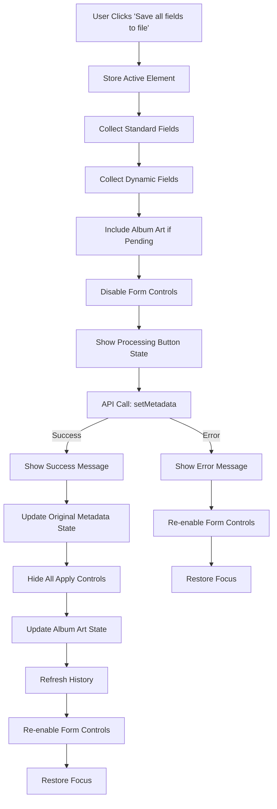
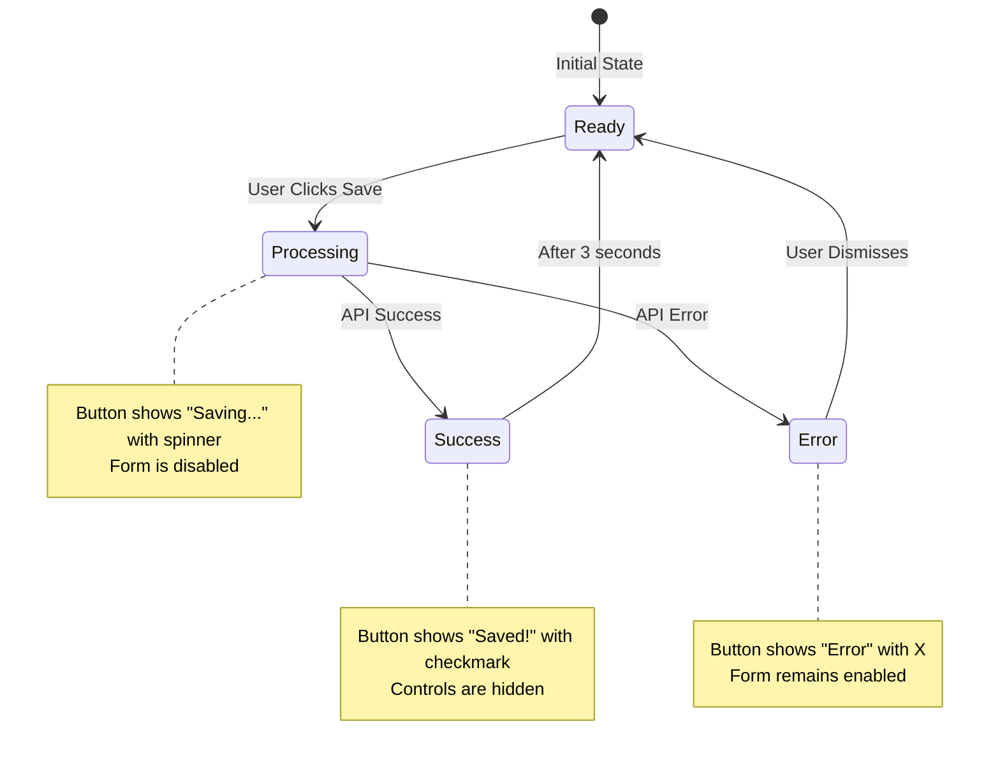

# Save All Fields to Individual File Frontend Architecture

## Table of Contents

1. [Executive Summary](#executive-summary)
2. [Save-All UI Workflow](#save-all-ui-workflow)
3. [Field Collection Logic](#field-collection-logic)
4. [Validation Sequence](#validation-sequence)
5. [API Payload Structure](#api-payload-structure)
6. [UI State Management](#ui-state-management)
7. [Error Display Strategies](#error-display-strategies)
8. [Progress Feedback Mechanisms](#progress-feedback-mechanisms)
9. [Success Confirmation Flow](#success-confirmation-flow)
10. [UI State Reset Process](#ui-state-reset-process)
11. [Specific Code References](#specific-code-references)

## Executive Summary

The save-all functionality in Metadata Remote provides a comprehensive solution for saving all metadata fields to an individual file in a single operation. This system intelligently collects data from both standard metadata fields (title, artist, album, etc.) and dynamically-generated custom fields, performs validation, constructs optimized API payloads, and provides comprehensive user feedback throughout the process.

### Key Features:
- **Comprehensive Field Collection**: Automatically gathers data from all visible standard and dynamic fields
- **Oversized Field Support**: Enhanced to collect values from both input fields and button elements (for fields ≥100 chars)
- **Intelligent Payload Construction**: Builds optimized API payloads with proper data sanitization
- **Real-time Progress Feedback**: Visual button status updates during save operations
- **Form State Management**: Disables UI during operations to prevent concurrent modifications
- **Album Art Integration**: Includes pending album art changes in the save operation
- **Focus Preservation**: Maintains user context and input focus after save completion
- **History Integration**: Automatically updates editing history after successful saves
- **Error Handling**: Comprehensive error display with format-specific messaging

### Technical Architecture:
The save-all functionality is implemented in `/home/will/deleteme/metadata-remote/static/js/metadata/editor.js` with integration points in `/home/will/deleteme/metadata-remote/static/js/app.js` and UI feedback systems in `/home/will/deleteme/metadata-remote/static/js/ui/button-status.js`.

## Save-All UI Workflow

### Primary User Flow



### Button State Transitions



## Field Collection Logic

### Standard Field Collection Process

The system iterates through predefined standard fields and collects their values:

**Standard Fields Array (Line 23):**
```javascript
const standardFields = ['title', 'artist', 'album', 'albumartist', 'date', 'genre', 'composer', 'track', 'disc'];
```

**Collection Implementation (Lines 218-225):**
```javascript
// Collect standard fields (only those that exist)
standardFields.forEach(field => {
    const input = document.getElementById(field);
    if (input) {
        // Treat single space as empty to ensure consistency
        data[field] = input.value === ' ' ? '' : input.value;
    }
});
```

### Dynamic Field Collection Process

The system tracks dynamic fields in a Map structure and collects editable fields:

**Dynamic Fields Tracking (Line 22):**
```javascript
let dynamicFields = new Map();
```

**Collection Implementation (Lines 227-234):**
```javascript
// Collect dynamic fields
dynamicFields.forEach((fieldInfo, fieldId) => {
    const input = document.getElementById(`dynamic-${fieldId}`);
    if (input && !input.disabled && fieldInfo.is_editable) {
        // Treat single space as empty to ensure consistency
        data[fieldId] = input.value === ' ' ? '' : input.value;
    }
});
```

**Enhanced Collection for Oversized Fields:**
The save function has been enhanced to handle fields displayed as buttons (for oversized content ≥100 characters):

```javascript
// Check if element is INPUT or BUTTON
const element = document.getElementById(`dynamic-${fieldId}`);
if (element) {
    if (element.tagName === 'INPUT') {
        // Normal input field
        data[fieldId] = element.value === ' ' ? '' : element.value;
    } else if (element.tagName === 'BUTTON') {
        // Oversized field displayed as button - get value from fieldInfo
        data[fieldId] = fieldInfo.value === ' ' ? '' : fieldInfo.value;
    }
}
```

This enhancement ensures all fields are collected regardless of their display format.

### Album Art Integration

Pending album art changes are automatically included in the save operation:

**Album Art Collection (Lines 236-238):**
```javascript
if (State.pendingAlbumArt) {
    data.art = State.pendingAlbumArt;
}
```

## Validation Sequence

### Pre-Save Validation

1. **File Context Validation (Line 209):**
   ```javascript
   if (!State.currentFile) return;
   ```

2. **Data Sanitization:** Single space values are converted to empty strings for consistency

3. **Field Availability Check:** Only existing input elements are processed

### Format-Specific Validation

The system includes format-aware error handling for album art:

**Album Art Format Validation (Lines 281-285):**
```javascript
if (errorMessage.includes('Album art is not supported')) {
    showButtonStatus(button, 'Album art not supported for this format', 'error', 5000);
} else {
    showButtonStatus(button, 'Error', 'error');
}
```

## API Payload Structure

### Payload Construction

The save-all operation constructs a comprehensive metadata payload:

```javascript
const data = {
    // Standard fields (if present)
    title: "Song Title",
    artist: "Artist Name",
    album: "Album Name",
    albumartist: "Album Artist",
    date: "2024",
    genre: "Rock",
    composer: "Composer Name",
    track: "1",
    disc: "1",
    
    // Dynamic fields (if present and editable)
    RATING: "5",
    MOOD: "Happy",
    CUSTOM_TAG: "Custom Value",
    
    // Album art (if pending)
    art: "base64EncodedImageData"
};
```

### API Endpoint

**Target Endpoint:**
- **URL:** `/metadata/${encodeURIComponent(filepath)}`
- **Method:** POST
- **Content-Type:** application/json

**API Implementation Reference (Lines 61-67 in api.js):**
```javascript
async setMetadata(filepath, data) {
    return this.call(`/metadata/${encodeURIComponent(filepath)}`, {
        method: 'POST',
        headers: {'Content-Type': 'application/json'},
        body: JSON.stringify(data)
    });
}
```

## UI State Management

### Form State Control

The system manages form state through comprehensive control disabling:

**Form Disable Implementation (Line 241):**
```javascript
UIUtils.setFormEnabled(false);
```

**Form Re-enable Implementation (Line 288):**
```javascript
UIUtils.setFormEnabled(true);
```

### State Persistence

The system updates the original metadata state to reflect saved changes:

**State Update Process (Lines 250-254):**
```javascript
Object.keys(data).forEach(key => {
    if (key !== 'art' && key !== 'removeArt') {
        State.originalMetadata[key] = data[key];
    }
});
```

### Control Visibility Management

All apply controls are hidden after successful save:

**Control Hiding Implementation (Line 256):**
```javascript
this.hideAllApplyControls();
```

**Dynamic Field Controls (Lines 258-264):**
```javascript
// Hide controls for dynamic fields too
dynamicFields.forEach((fieldInfo, fieldId) => {
    const controls = document.querySelector(`.apply-field-controls[data-field="${fieldId}"]`);
    if (controls) {
        controls.classList.remove('visible');
    }
});
```

## Error Display Strategies

### Primary Error Display

Errors are displayed through the button status system:

**Generic Error Display (Line 275):**
```javascript
showButtonStatus(button, 'Error', 'error');
```

**Format-Specific Error Display (Lines 280-285):**
```javascript
const errorMessage = err.message || '';
if (errorMessage.includes('Album art is not supported')) {
    showButtonStatus(button, 'Album art not supported for this format', 'error', 5000);
} else {
    showButtonStatus(button, 'Error', 'error');
}
```

### Error Logging

All errors are logged to the console for debugging:

**Error Logging Implementation (Line 278):**
```javascript
console.error('Error saving metadata:', err);
```

## Progress Feedback Mechanisms

### Button Status System

The progress feedback uses a sophisticated button status system:

**Processing State Display (Line 242):**
```javascript
showButtonStatus(button, 'Saving...', 'processing');
```

**Success State Display (Line 248):**
```javascript
showButtonStatus(button, 'Saved!', 'success', 3000);
```

### Visual Feedback Implementation

**Button Status Implementation (Lines 19-108 in button-status.js):**
- Animated status transitions
- Icon-based feedback (spinner, checkmark, X)
- Automatic state clearing after timeout
- Tooltip support for longer messages

## Success Confirmation Flow

### Success State Sequence

1. **Show Success Message (Line 248):**
   ```javascript
   showButtonStatus(button, 'Saved!', 'success', 3000);
   ```

2. **Update State (Lines 250-254):**
   ```javascript
   Object.keys(data).forEach(key => {
       if (key !== 'art' && key !== 'removeArt') {
           State.originalMetadata[key] = data[key];
       }
   });
   ```

3. **Hide Controls (Line 256):**
   ```javascript
   this.hideAllApplyControls();
   ```

4. **Album Art State Update (Lines 266-271):**
   ```javascript
   if (State.pendingAlbumArt) {
       State.currentAlbumArt = State.pendingAlbumArt;
       document.querySelector('.save-image-btn').style.display = 'none';
       document.querySelector('.apply-folder-btn').style.display = 'none';
   }
   State.pendingAlbumArt = null;
   ```

5. **History Refresh (Line 273):**
   ```javascript
   loadHistoryCallback();
   ```

## UI State Reset Process

### Focus Restoration

The system preserves and restores user focus after save operations:

**Focus Preservation (Line 212):**
```javascript
const previouslyFocused = document.activeElement;
```

**Focus Restoration (Lines 291-298):**
```javascript
// Restore focus to the previously focused element
if (previouslyFocused && previouslyFocused.id && document.getElementById(previouslyFocused.id)) {
    const element = document.getElementById(previouslyFocused.id);
    element.focus();
    if (element.tagName === 'INPUT') {
        element.dataset.editing = 'false';
        element.readOnly = true;
    }
}
```

### Form State Reset

The system resets form controls to their non-editing state:

**Input State Reset (Lines 295-297):**
```javascript
if (element.tagName === 'INPUT') {
    element.dataset.editing = 'false';
    element.readOnly = true;
}
```

## Specific Code References

### Core Save Function
- **File:** `/home/will/deleteme/metadata-remote/static/js/metadata/editor.js`
- **Lines:** 208-299
- **Function:** `async save(showButtonStatus)`

### Key Implementation Points

1. **State Check (Line 209):**
   ```javascript
   if (!State.currentFile) return;
   ```

2. **Focus Preservation (Line 212):**
   ```javascript
   const previouslyFocused = document.activeElement;
   ```

3. **Button Reference (Line 214):**
   ```javascript
   const button = document.querySelector('.save-btn');
   ```

4. **Data Object Initialization (Line 215):**
   ```javascript
   const data = {};
   ```

5. **Standard Field Collection (Lines 218-225):**
   ```javascript
   standardFields.forEach(field => {
       const input = document.getElementById(field);
       if (input) {
           data[field] = input.value === ' ' ? '' : input.value;
       }
   });
   ```

6. **Dynamic Field Collection (Lines 227-234):**
   ```javascript
   dynamicFields.forEach((fieldInfo, fieldId) => {
       const input = document.getElementById(`dynamic-${fieldId}`);
       if (input && !input.disabled && fieldInfo.is_editable) {
           data[fieldId] = input.value === ' ' ? '' : input.value;
       }
   });
   ```

7. **Album Art Integration (Lines 236-238):**
   ```javascript
   if (State.pendingAlbumArt) {
       data.art = State.pendingAlbumArt;
   }
   ```

8. **Form Disable (Line 241):**
   ```javascript
   UIUtils.setFormEnabled(false);
   ```

9. **Processing State (Line 242):**
   ```javascript
   showButtonStatus(button, 'Saving...', 'processing');
   ```

10. **API Call (Line 245):**
    ```javascript
    const result = await API.setMetadata(State.currentFile, data);
    ```

11. **Success Handling (Lines 247-273):**
    ```javascript
    if (result.status === 'success') {
        showButtonStatus(button, 'Saved!', 'success', 3000);
        // ... state updates and cleanup
    }
    ```

12. **Error Handling (Lines 274-285):**
    ```javascript
    } else {
        showButtonStatus(button, 'Error', 'error');
    }
    ```

13. **Exception Handling (Lines 277-285):**
    ```javascript
    } catch (err) {
        console.error('Error saving metadata:', err);
        // ... format-specific error handling
    }
    ```

14. **Form Re-enable (Line 288):**
    ```javascript
    UIUtils.setFormEnabled(true);
    ```

15. **Focus Restoration (Lines 291-298):**
    ```javascript
    if (previouslyFocused && previouslyFocused.id && document.getElementById(previouslyFocused.id)) {
        const element = document.getElementById(previouslyFocused.id);
        element.focus();
        if (element.tagName === 'INPUT') {
            element.dataset.editing = 'false';
            element.readOnly = true;
        }
    }
    ```

### Global Function Integration
- **File:** `/home/will/deleteme/metadata-remote/static/js/app.js`
- **Lines:** 374-375
- **Function:** `save()`
- **Implementation:**
  ```javascript
  function save() {
      MetadataEditor.save(ButtonStatus.showButtonStatus);
  }
  ```

### HTML UI Integration
- **File:** `/home/will/deleteme/metadata-remote/templates/index.html`
- **Lines:** 213-216
- **Button Implementation:**
  ```html
  <button type="button" class="save-btn btn-status" onclick="save()">
      <span class="btn-status-content">Save all fields to file</span>
      <span class="btn-status-message"></span>
  </button>
  ```

### Button Status System
- **File:** `/home/will/deleteme/metadata-remote/static/js/ui/button-status.js`
- **Lines:** 19-108
- **Function:** `showButtonStatus(button, message, type, duration)`

### Form State Management
- **File:** `/home/will/deleteme/metadata-remote/static/js/ui/utilities.js`
- **Lines:** 37-56
- **Function:** `setFormEnabled(enabled)`

### API Communication
- **File:** `/home/will/deleteme/metadata-remote/static/js/api.js`
- **Lines:** 61-67
- **Function:** `setMetadata(filepath, data)`

### State Management
- **File:** `/home/will/deleteme/metadata-remote/static/js/state.js`
- **Lines:** 19-20
- **Properties:** `originalMetadata`, `pendingAlbumArt`

The save-all functionality represents a sophisticated frontend implementation that handles comprehensive metadata saving with robust error handling, user feedback, and state management. The system is designed to provide a seamless user experience while maintaining data integrity and providing clear feedback throughout the save process.